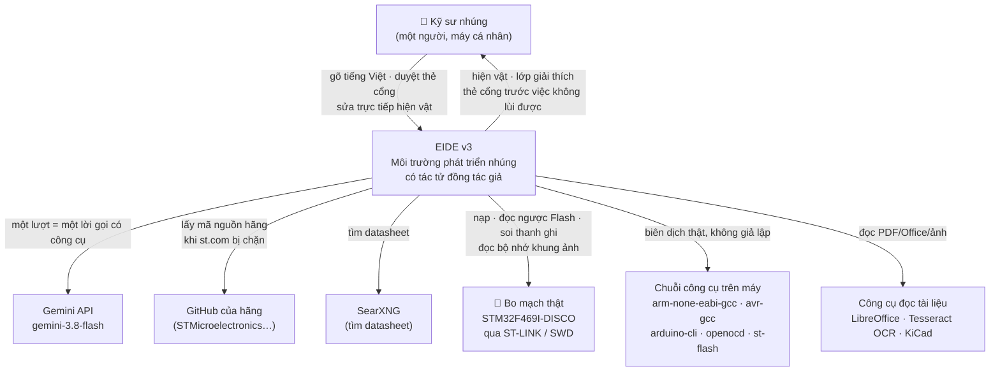
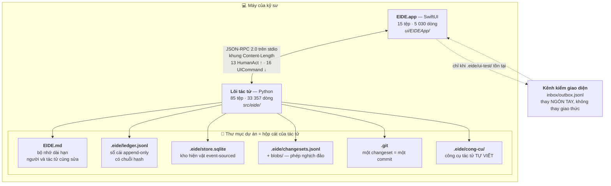
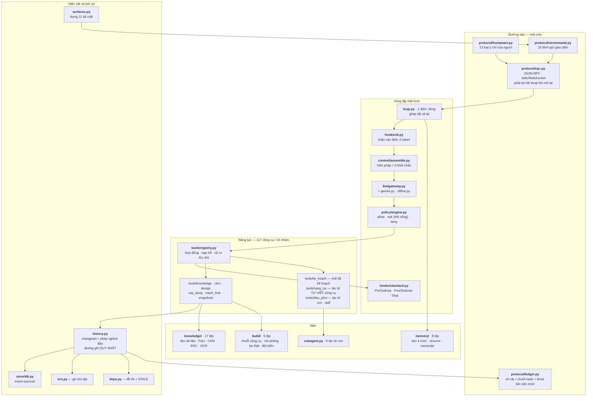

# EIDE-C4-46 — Kiến trúc theo mô hình C4

*Đề tài: **PHÁT TRIỂN PHẦN MỀM NHÚNG CÓ ỨNG DỤNG TRÍ TUỆ NHÂN TẠO (AI)***

*v1.0 · 29/09/2026 · Vũ Trí Công · GVHD: TS. Nguyễn Trung Hiếu*

| | |
|---|---|
| **Mã tài liệu** | EIDE-C4-46 v1.0 |
| **Quan hệ** | Bổ trợ cho [EIDE-MDD-40 v3.0](../review-v3/docs/md/EIDE-MDD-40_v3.0_Thiet_ke_Tong_the.md). MDD-40 nói *thiết kế phải thế nào*; tài liệu này nói *mã đang thế nào*. Lệch giữa hai bên là một mục `[DEV-2xx]` trong [EIDE-DEV-LOG.md](EIDE-DEV-LOG.md). |
| **Đối tượng đọc** | Người mới vào dự án; người rà soát kiến trúc; hội đồng bảo vệ |
| **Kiểm bằng máy** | `.venv/bin/python tools/kiem_tai_lieu.py` — dò mọi tên công cụ, đường dẫn mã, mã lỗi và con số trong tài liệu này với mã đang chạy |

---

## Vì sao có tài liệu này, và nó KHÔNG thay được gì

Mô hình C4 (Context · Container · Component · Code) trả lời bốn câu hỏi ở bốn độ phóng: *hệ
thống nằm giữa những ai* → *nó gồm mấy khối chạy được* → *mỗi khối gồm những phần nào* →
*phần quan trọng nhất viết ra sao*.

Tài liệu này **mô tả mã đang chạy**, không mô tả ý định. Mỗi hộp trong mọi sơ đồ đều dẫn tới
một đường dẫn có thật, và `tools/kiem_tai_lieu.py` kiểm điều đó bằng máy. Nhưng nó **không**
kiểm được phần khó nhất — *mô tả này có nói đúng cách hệ thống hoạt động không*. Phần ấy vẫn
phải đọc, và nói ra giới hạn ấy còn hơn để một dấu tích xanh nói hộ.

**Số đo của cây mã, 29/09/2026:**

| Phần | Tệp | Dòng |
|---|---|---|
| Lõi Python (`src/eide/`) | 85 | 33 357 |
| Giao diện Swift (`ui/EIDEApp/`) | 15 | 5 030 |
| Ca kiểm (`tests/`) | 43 | 15 964 |
| Bộ đo và kịch bản (`tools/`) | 35 | 13 427 |

---

## C1 — Bối cảnh: EIDE nằm giữa những ai



**Bốn điều đáng nói ở mức này**, vì chúng định hình mọi thứ bên dưới:

1. **Một người, một máy.** Không có tài khoản, không phân quyền, không máy chủ. Quyết định
   của chủ sản phẩm 24/09/2026 (TC071 ngoài phạm vi). Vì vậy lõi **không mở cổng mạng nào**
   — giao diện chạy lõi làm tiến trình con và nói JSON-RPC trên stdio.
2. **Chỉ một mô hình:** `gemini-3.8-flash`, ép bằng `ALLOWED_MODELS` trong
   `src/eide/config.py`. Khoá API chỉ nằm ở `.env` (đã gitignore).
3. **Phần cứng là một tác nhân ngoài, không phải một mô hình.** Mọi con số về bo đều đọc từ
   silicon: ID chip qua SWD, Flash đọc ngược từng byte, bộ nhớ khung ảnh đổ ra PNG. Không có
   đường nào để tác tử *khai* một kết quả phần cứng.
4. **Tác tử không tự cài gì.** `env.check` nói máy thiếu gì; `tool.install` chỉ chạy sau khi
   người duyệt qua cổng `G-TOOL`.

---

## C2 — Khối chạy được



### Hai bất biến của ranh giới này

**I1 — một cửa vào.** Mọi cái chạm của người (gõ câu, bấm nút trong thẻ, chuyển tab, sửa một
ô) đều thành một `HumanAct` đi qua `console.act`. Không có đường tắt nào từ giao diện vào lõi.
Kênh kiểm giao diện cũng đi qua đúng cửa ấy — nó thay ngón tay người, không thay giao thức.

**I3 — giao diện không quyết gì.** Mọi thứ người nhìn thấy đến từ một trong 16 `UICommand`.
Bộ vẽ khối là *chung*: lõi thêm loại khối mới thì app vẽ được ngay, không phải sửa Swift. Lõi
gửi loại khối app chưa biết thì app **nói ra**, không bỏ qua im lặng
(`khoi_chua_biet_ve` trong `ui/EIDEApp/Sources/EIDE/State/AppState.swift`).

### Vì sao tách hai tiến trình

Lõi chạy được **không cần giao diện** (`python -m eide --go "…"` in ra terminal), nên mọi
phép đo tự động chạy được mà không dựng app. Ngược lại, app **không** có logic nghiệp vụ nào
để mà sai — nó là hình chiếu. Một lỗi nghiệp vụ không thể trốn trong Swift.

---

## C3 — Thành phần bên trong lõi



### Trách nhiệm từng thành phần

| Thành phần | Tệp | Nó chịu trách nhiệm gì | Điều nó TỪ CHỐI làm |
|---|---|---|---|
| Vòng lặp | `src/eide/loop.py` | Một lượt: nhắc → mô hình → công cụ → hook → trả lời | Không tự quyết thay ba lớp chặn |
| Chặn xác định | `src/eide/hooks/s0.py` · `src/eide/rules/s0_rules.yaml` | STOP · BACKREF · G-OPS · P-SAFE · P-LAW · P-QUAL · P-INJ — **trước khi tiêu một token nào** | Không "hỏi mô hình xem có nên chặn không" |
| Chính sách | `src/eide/policy/engine.py` · `src/eide/policy/policy.yaml` | `allow` / `ask` (dựng thẻ cổng) / `deny` theo rủi ro và mức tự chủ | Không tự duyệt thay người ở R3/R4 |
| Ngữ cảnh | `src/eide/context/assemble.py` | Hiến pháp + EIDE.md + `<inventory>` + `<facts>` + `<human_edits>` + `<pending>` | Không để mô hình tự đoán dự án có gì (N3) |
| Kho hiện vật | `src/eide/store/db.py` | Event-sourced, mọi phiên bản giữ lại | Không ghi đè |
| Lịch sử | `src/eide/history.py` | **Đường ghi duy nhất.** Mọi công cụ ghi đều qua `ghi_kho()`/`ghi_tep()` | Không có đường nào ghi mà không sinh changeset (N9) |
| Sổ cái | `src/eide/protocol/ledger.py` | Append-only, chuỗi hash, khoá `flock` liên tiến trình | Không cho sửa quá khứ; `verify()` phân biệt "hai tiến trình cùng ghi" với "bị sửa" |
| Bề mặt | `src/eide/surfaces.py` | Dựng 11 `SurfaceModel` từ kho + sổ cái | Không dựng ô trống câm — mỗi ô trống nói *chưa có gì · vì sao · cần gì* |
| Tri thức | `src/eide/knowledge/` | Nạp tài liệu theo magic bytes, trích Fact **bằng mã**, bốn tầng tin cậy | `fact.compare` từ chối kết luận khi một vế là tầng ĐỒNG |
| Dựng và đo | `src/eide/build/` | Biên dịch thật · mô phỏng theo tiêu chí · soi bo thật · **đo độ nhạy bộ kiểm** | `toolchain.py` chỉ chọn `arduino-cli` khi dự án THẬT SỰ có `.ino` |
| Bộ nhớ | `src/eide/memory/` | Nén 4 mức, resume khi mở lại, transcript ghi đĩa trước | `C1` không mất gì; `undo_compact` trong 24 giờ |
| Kế hoạch | `src/eide/ke_hoach.py` · `src/eide/tools/ke_hoach.py` | Việc lớn thì khoá mọi công cụ ghi cho tới khi người duyệt | Kế hoạch phải là hiện vật, không phải một đoạn văn |
| Tự bù năng lực | `src/eide/nang_luc.py` · `src/eide/tools/nang_luc.py` | Tác tử tự viết công cụ cho chính nó vào `.eide/cong-cu/` | `tool.reload` chỉ nạp khi **bộ kiểm của công cụ ấy xanh** |

---

## C4 — Mã: bốn chỗ quan trọng nhất

Ở độ phóng này chỉ nêu bốn chỗ mà hiểu sai sẽ hiểu sai cả hệ thống.

### 4.1 · Một lượt đi qua ba lớp chặn

```
HumanAct ─► hook UserPromptSubmit (S0, 0 token) ─► [chặn / hỏi / cảnh báo] ─┐
                                                                            │
   ┌────────────────────────────────────────────────────────────────────────┘
   ▼
 assemble(hiến pháp + EIDE.md + <inventory> + <facts> + <human_edits> + <pending>)
   │
   ▼
 llm.stream ─► tool_calls ─► PreToolUse ─► policy.decide ─► tools.run ─► PostToolUse
                                 │             │
                            sandbox        allow / ask (thẻ cổng) / deny
                            explain
                            constant-guard
   │
   ▼
 hook Stop ─► giả định đã nói? người vừa sửa đã được nhắc? đã nói gì chưa?
              có việc nào chưa ai kiểm chứng?
```

**Không có đường nào đi vòng qua ba lớp đó.** Đây là lý do v3 bỏ máy trạng thái S0–S6 của
v1.x: ở kiến trúc cũ một nút hỏng giữa chuỗi làm cả lượt chết tại chỗ; ở đây lỗi quay về mô
hình như **dữ liệu có hướng dẫn** (`{code, message_vi, hint_for_agent, alternatives}`) và nó
đổi hướng.

### 4.2 · Mọi thay đổi hoàn tác được — một đường ghi duy nhất

Công cụ ghi **không** gọi thẳng kho hay ghi tệp. Tất cả đi qua `history.ghi_kho()` /
`history.ghi_tep()` trong `src/eide/history.py`, và chỉ nơi đó mới biết dựng phép nghịch đảo.
Muốn ghi mà không để lại dấu thì phải sửa `history.py` — đó là chủ ý.

| Loại | Phép nghịch đảo |
|---|---|
| Kho (REQ, ADR, Fact…) | Giữ nguyên `canonical` bản trước |
| Tệp (mã, netlist, EIDE.md) | Một changeset một commit git; nghịch đảo là `git revert`. Bản sao theo hash ở `.eide/blobs` là đường lui thứ hai |
| **Không đảo ngược được** (nạp chip, ghi eFuse, cài công cụ) | Vẫn là changeset, mang `reversible=false` kèm lý do bằng tiếng Việt. Hoàn tác cả lượt sẽ **giữ nguyên** nó và cảnh báo *"bo vẫn đang chạy bản cũ"* |

Sửa của **người** cũng là changeset (`author=human`), cũng có lớp giải thích, và kéo theo
STALE y như sửa của tác tử.

### 4.3 · Tầng tin cậy là thứ kiểm được, không phải nhãn dán

Bốn tầng: **VÀNG** (datasheet đã duyệt và xác nhận dòng) · **BẠC** (nguồn đã duyệt, chưa xác
nhận dòng) · **NGƯỜI** (người dùng khẳng định, không có tài liệu) · **ĐỒNG** (tri thức chung
của mô hình).

Chỗ dễ hiểu sai: `NGUOI` **cao hơn** `DONG`, nên nó là mục tiêu hấp dẫn để gán bừa. Ngày
29/09/2026 đo được đúng chuyện đó — tác tử gán `quyet_boi="nguoi"` cho câu *"Làm cho mình cái
mạch thông minh."* rồi sinh một ADR nói người dùng đã quyết (DEV-291, lỗi L1).

Nay `store.option_choose` với `quyet_boi="nguoi"` phải **chứng minh được**, ba phép kiểm, cả
ba đều tra từ dữ liệu đã có:

1. Câu trích có thật trong sổ cái không (`human_act`).
2. Câu ấy có chữ mang nghĩa lựa chọn không.
3. Có nhắc đúng phương án đang chốt không.

Không qua thì lỗi nói ra **hai đường đi** — hạ xuống `quyet_boi="tac_tu"`, hoặc hỏi người
dùng — vì chặn mà không chỉ lối thì tác tử sẽ thử lại đúng lối cũ.

### 4.4 · Không có "đạt" nào không có bằng chứng

Ba cơ chế xếp chồng, mỗi cái canh một kiểu đạt giả:

| Cơ chế | Tệp | Nó canh gì |
|---|---|---|
| **Tiêu chí nêu trước** | `src/eide/build/tieu_chi.py` · `sim.criteria` | Tiêu chí phán xử kết quả, không phải chương trình mô phỏng. Đổi ngưỡng sau khi đã có kết quả → cổng `G-QUAL` |
| **Verifier độc lập** | `src/eide/subagent.py` · `src/eide/kiem_chung.py` | Tác tử con tuyên "đạt" thì hook `SubagentStop` tự gọi `verifier` (chỉ đọc). Kết luận ba trạng thái: `đạt` / `không đạt` / `chưa đủ dữ kiện` |
| **Đo độ nhạy bộ kiểm** | `src/eide/build/dot_bien.py` · `test.sensitivity` | Phá mã sản phẩm rồi chạy lại. Không ca nào đỏ ⇒ bộ kiểm không nhìn thấy tệp ấy. Ra đời vì một bộ kiểm 6 ca đầy đủ tên/ngưỡng/JSON đã xanh mãi mãi (DEV-288) |

Cả ba đều trả **ba trạng thái**, không phải hai. Gộp "chưa đo được" vào "không đạt" là nói
sai, và gộp nó vào "đạt" là nói dối.

---

## Bản đồ tài liệu

| Tài liệu | Nói về | Trạng thái |
|---|---|---|
| [EIDE-MDD-40 v3.0](../review-v3/docs/md/EIDE-MDD-40_v3.0_Thiet_ke_Tong_the.md) | Thiết kế tổng thể — nguồn sự thật | Đang hiệu lực |
| **EIDE-C4-46** (tài liệu này) | Mã đang thế nào, bốn độ phóng | Đang hiệu lực |
| [EIDE-MEM-42](EIDE-MEM-42_Quan_ly_Bo_nho_va_Nen_Bo_nho.md) | Bộ nhớ và nén ngữ cảnh | Đang hiệu lực |
| [EIDE-ING-43](EIDE-ING-43_Duong_ong_Nap_Tai_lieu_va_Trich_xuat.md) | Đường ống nạp tài liệu và trích xuất | Đang hiệu lực |
| [EIDE-HIER-45](EIDE-HIER-45_Mo_hinh_Cay_khoi_Phan_cap.md) | Cây khối phân cấp | Đang hiệu lực |
| [EIDE-SCH-44](EIDE-SCH-44_Sinh_So_do_KiCad_va_Render.md) | Sinh sơ đồ KiCad (sau cờ tính năng) | Đang hiệu lực |
| [EIDE-NOTE-42](EIDE-NOTE-42_Luu_tru_script_va_quy_trinh.md) | Lưu trữ script và quy trình | Đang hiệu lực |
| [EIDE-GAP-44](EIDE-GAP-44_Ra_soat_MEM_ING.md) | Rà soát khoảng trống MEM/ING | Lịch sử |
| [EIDE-DEV-LOG](EIDE-DEV-LOG.md) | Mọi lệch mã ↔ tài liệu, theo thời gian | Nhật ký |
| AGD-32 · AAD-33 v1.0/v2.0 · UIP-34 | Thiết kế v1.x–v2.0 | **Lịch sử** — đã hợp nhất vào MDD-40 |
