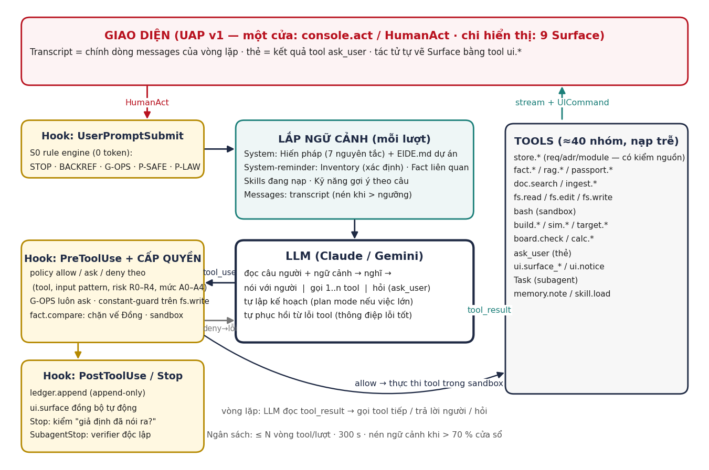
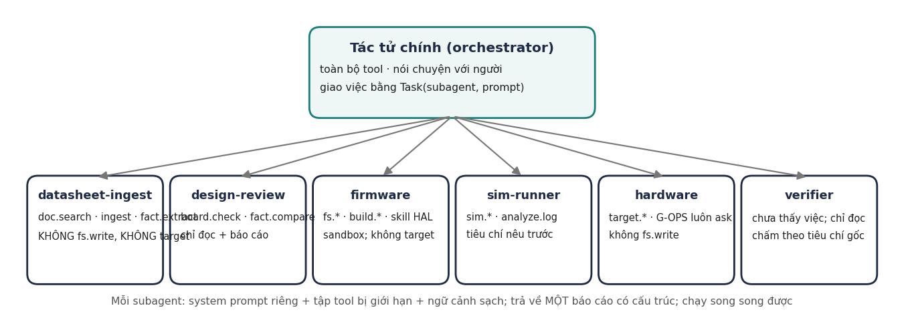
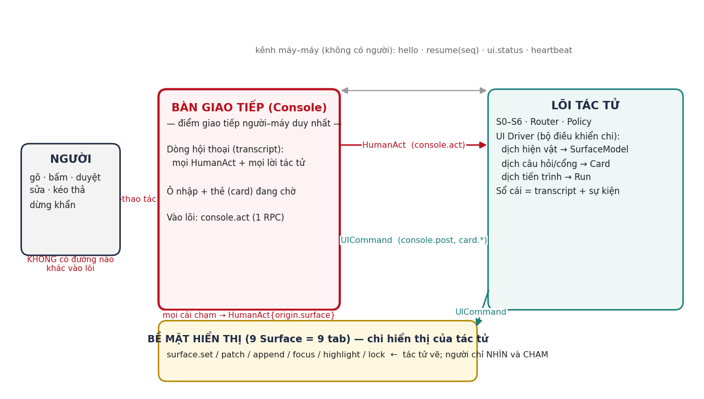
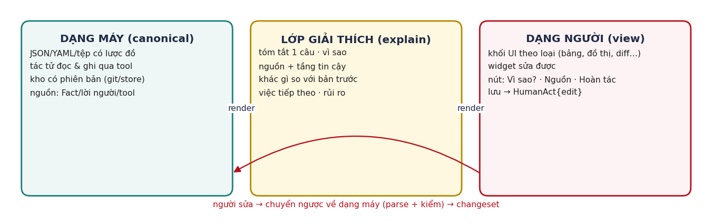
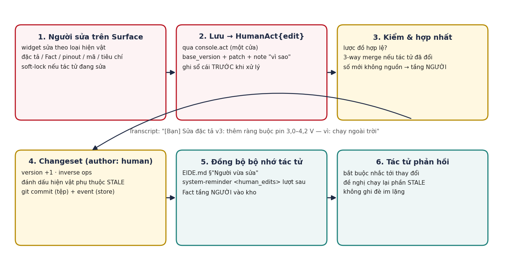
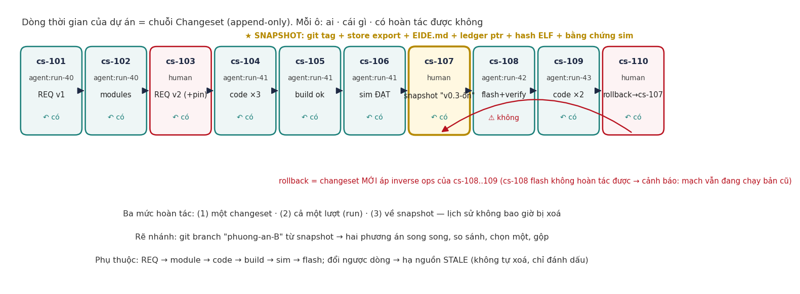
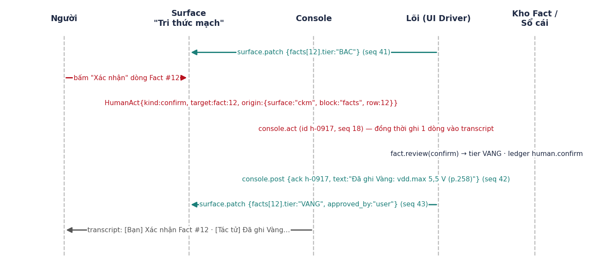

**EIDE v3.0**

**TÀI LIỆU THIẾT KẾ TỔNG THỂ — TÁC TỬ KỸ SƯ NHÚNG CỘNG TÁC VỚI NGƯỜI**

Nguyên tắc · Kiến trúc vòng lặp · Nền tri thức · Giao thức giao diện · UX cộng tác: hiện vật hai dạng, đồng bộ khi người sửa, changeset & rollback, snapshot

*Mã tài liệu EIDE-MDD-40 · v3.0 · 25/09/2026*

|                     |                                                                                                                                                                                                  |
|---------------------|--------------------------------------------------------------------------------------------------------------------------------------------------------------------------------------------------|
| **Mã tài liệu**     | EIDE-MDD-40 (Master Design Document) v3.0                                                                                                                                                        |
| **Thay thế**        | EIDE-AGD-32 v1.0, EIDE-AAD-33 v1.0/v2.0, EIDE-UIP-34 v1.0 — nội dung được hợp nhất, sửa và bổ sung trong tài liệu này; các tài liệu cũ chỉ còn giá trị tham khảo lịch sử                         |
| **Ngày**            | 25/09/2026                                                                                                                                                                                       |
| **Dự án**           | EIDE — Embedded IDE có tác tử (github.com/mobiluckvn/EIDE)                                                                                                                                       |
| **Khung**           | Đề án tốt nghiệp Thạc sĩ ngành Kỹ thuật Điện tử — PTIT                                                                                                                                           |
| **Người hướng dẫn** | TS. Nguyễn Trung Hiếu                                                                                                                                                                            |
| **Tác giả**         | Vũ Trí Công                                                                                                                                                                                      |
| **Đầu vào**         | Usecase_Test_Agent_Ky_Su_Nhung.xlsx (19 UC, 76 TC, đo 23/09/2026); bộ hồ sơ EIDE v1.2 (SRS-02, CDS-12, APD-08, UXD-13 v2.0, UXC-31); kiến trúc Claude Code / Claude Agent SDK làm mẫu tham chiếu |
| **Đối tượng đọc**   | Chủ sản phẩm; người phát triển lõi (Python); người phát triển giao diện (Swift); người kiểm thử; Claude Code (rà soát và hiện thực)                                                              |

***Lịch sử sửa đổi***

| **Phiên bản** | **Ngày**   | **Nội dung**                                                                                                                                                                                                                                                                                                                                                | **Người sửa** |
|---------------|------------|-------------------------------------------------------------------------------------------------------------------------------------------------------------------------------------------------------------------------------------------------------------------------------------------------------------------------------------------------------------|---------------|
| v1.x          | 24/09/2026 | AGD-32 (thiết kế sản phẩm, máy trạng thái S0–S6), AAD-33 v1.0 (kiến trúc nhiều tầng NLU), UIP-34 (giao thức UI một cửa).                                                                                                                                                                                                                                    | VTC           |
| v2.0          | 25/09/2026 | AAD-33 v2.0: kiến trúc vòng lặp kiểu Claude Code.                                                                                                                                                                                                                                                                                                           | VTC           |
| v3.0          | 25/09/2026 | Hợp nhất toàn bộ thành một tài liệu; thêm Phần E — UX cộng tác người–tác tử: hiện vật hai dạng + lớp giải thích, hợp đồng trình bày cho 22 loại hiện vật, đường ống đồng bộ khi người sửa, mô hình Changeset/rollback ba mức, Snapshot "bản ưng ý", rẽ nhánh phương án, đồ thị phụ thuộc và STALE; thêm 2 nguyên tắc N8, N9; bộ ca kiểm cộng tác CX01–CX16. | VTC           |

**PHẦN A — MỤC TIÊU, PHẠM VI, NGUYÊN TẮC**

**A1. Sản phẩm là gì**

EIDE là môi trường phát triển nhúng có một tác tử (agent) làm việc cùng kỹ sư. Kỹ sư nói bằng ngôn ngữ tự nhiên; tác tử căn cứ ý định để đi qua các chặng: làm rõ ý tưởng và đề xuất giải pháp → tìm và duyệt tài liệu, tổng hợp Bản đồ tri thức mạch (cấu trúc, đi dây, chân, bus, nguồn) → cài công cụ → viết mã → biên dịch → mô phỏng theo tiêu chí → nạp và gỡ lỗi trên mạch thật. Mọi thứ tác tử làm ra hiện trên các tab để người và tác tử cùng làm; mọi phép so sánh, kiểm tra, quyết định dựa trên datasheet thật do người nạp hoặc tác tử tìm và người duyệt.

**Điểm mới của v3.0:** tác tử và người là hai tác giả bình đẳng trên cùng một bộ hiện vật. Mỗi hiện vật có dạng máy (để tác tử làm việc), dạng người (để người hiểu và sửa) và lớp giải thích nối hai dạng; mọi thay đổi của bất kỳ ai là một changeset hoàn tác được; người có thể ghi lại "bản ưng ý" (snapshot) và quay về đó bất cứ lúc nào.

**A2. Phạm vi**

- **Trong:** 7 chặng (A4); 9 tab + Lịch sử; tác tử vòng lặp; nền tri thức; giao thức UI; cộng tác người–tác tử; kiểm thử 76 TC + 16 CX.

- **Ngoài (quyết định 24/09/2026):** bố trí mạch in, Gerber, DRC (UC15); tài khoản/phân quyền (TC071) — ứng dụng một người trên máy cá nhân; nhiều người sửa đồng thời (TC067) chỉ ở mức phát hiện xung đột tệp.

**A3. Chín nguyên tắc bất biến**

Bảy nguyên tắc từ v1.4 và hai nguyên tắc mới cho cộng tác. Mỗi nguyên tắc chỉ rõ nó sống ở đâu trong kiến trúc (không dựa vào lời dặn mô hình một mình) và ca kiểm nào canh.

| **Mã**   | **Nguyên tắc**                                                                                                                                                                                                                                                      | **Sống ở đâu (mã, không chỉ lời dặn)**                                                                       | **Ca canh**               |
|----------|---------------------------------------------------------------------------------------------------------------------------------------------------------------------------------------------------------------------------------------------------------------------|--------------------------------------------------------------------------------------------------------------|---------------------------|
| N1       | Datasheet là nguồn sự thật: mọi con số để so sánh/quyết định/sinh mã phải truy vết tới tài liệu có phiên bản, trang, trích đoạn                                                                                                                                     | Hiến pháp §1; fact.query/compare; constant-guard (hook PreToolUse); store.req_create cần source_quote        | TC008, 042, 075           |
| N2       | Bốn tầng tin cậy: VÀNG (datasheet đã duyệt và xác nhận) · BẠC (nguồn đã duyệt, chưa xác nhận dòng) · NGƯỜI (người dùng khẳng định, không có tài liệu) · ĐỒNG (tri thức chung của mô hình). So sánh chỉ hợp lệ khi cả hai vế ∈ {VÀNG, BẠC, NGƯỜI}; ĐỒNG chỉ để gợi ý | fact.compare từ chối vế ĐỒNG; UI tô màu; NGƯỜI được ghi origin=user và luôn hiện cảnh "không có tài liệu"    | TC013, 021, 031, CX05     |
| N3       | Kiểm kê thì xác định: tình trạng dự án do mã dựng, tiêm vào ngữ cảnh; mô hình không đoán dự án có gì                                                                                                                                                                | \<inventory\> system-reminder mỗi lượt                                                                       | TC008, 065                |
| N4       | Hỏi một cụm, tối đa 2 lần/lượt, nói ra giả định                                                                                                                                                                                                                     | Hiến pháp §4; ask_user nhiều mục; hook Stop kiểm giả định                                                    | TC004, 057                |
| N5       | Cổng an toàn đứng trước phép đoán: thao tác không đảo ngược, điện lưới, pháp lý, hạ chuẩn — chặn/hỏi trước khi mô hình được gọi                                                                                                                                     | Hook UserPromptSubmit (S0 rule engine); target.dangerous never_auto                                          | TC007, 035, 036, 068, 069 |
| N6       | Không đạt giả: tiêu chí là của người; không sửa tiêu chí/test để đạt; log rỗng ≠ đạt; phần chưa mô phỏng nói rõ                                                                                                                                                     | sim.criteria đổi → G-QUAL; PostToolUse gắn cờ log rỗng; verifier độc lập                                     | TC019, 022, 076           |
| N7       | Chỉ thị cho tác tử ≠ yêu cầu sản phẩm; rủi ro tác tử phát hiện vào risk, không vào FR                                                                                                                                                                               | Hiến pháp §5; store.req_create bắt buộc trích lời người                                                      | TC003, 017, 024, 028      |
| N8 (mới) | Mọi thứ tác tử làm ra đều có dạng người hiểu được: tóm tắt một câu, vì sao, nguồn, tầng tin cậy, khác gì bản trước, việc tiếp theo — theo hợp đồng trình bày của loại hiện vật đó                                                                                   | Lớp giải thích bắt buộc trong lược đồ hiện vật; hook PostToolUse từ chối ghi hiện vật thiếu explain; bảng E2 | CX01–CX04                 |
| N9 (mới) | Mọi thay đổi — của người hay tác tử — là một changeset hoàn tác được; lịch sử không bị xoá; sửa của người được tác tử biết và nhắc tới ở lượt sau; snapshot do người đặt tên là bất biến                                                                            | Store event-sourced + git; hook Stop kiểm "đã nhắc thay đổi của người?"; snapshot = tag + export bất biến    | CX05–CX16                 |

**A4. Bảy chặng làm việc theo ý định**

Người có thể vào ở bất kỳ chặng nào; \<inventory\> cho tác tử biết dự án đang ở đâu và cái gì đã có, để không làm lại từ đầu.

| **Chặng**                          | **Đầu vào**                                                     | **Hiện vật ra (xem E2 cho cách trình bày)**                                                             | **Cổng**               | **Tab**                           |
|------------------------------------|-----------------------------------------------------------------|---------------------------------------------------------------------------------------------------------|------------------------|-----------------------------------|
| C1 Làm rõ & giải pháp              | Ý tưởng bằng lời; trả lời cụm câu hỏi                           | Đặc tả yêu cầu có phiên bản; rủi ro; 2–4 phương án so sánh; phương án chọn                              | G-DESIGN               | Yêu cầu & Giải pháp               |
| C2 Tài liệu & Bản đồ tri thức mạch | Datasheet người nạp / tác tử tìm + người duyệt; thiết kế có sẵn | Hộ chiếu chip; Fact; CKM (chip, chân, net, bus, nguồn); sơ đồ khối; schematic/netlist; pinout; BOM; ERC | G-DATA, G-DESIGN       | Tài liệu; Tri thức mạch; Thiết kế |
| C3 Môi trường công cụ              | Hộ chiếu (ISA)                                                  | Toolchain/mô phỏng/bộ nạp đúng phiên bản; manifest ISA                                                  | G-TOOL                 | Công cụ                           |
| C4 Firmware                        | Pinout đã duyệt; Fact                                           | Khung dự án; driver; logic; build sạch; map                                                             | G-FILE                 | Mã nguồn                          |
| C5 Mô phỏng                        | Firmware; tiêu chí nêu trước                                    | criteria.yaml; log/VCD; kết luận theo tiêu chí; phần không mô phỏng được                                | G-QUAL                 | Mô phỏng                          |
| C6 Mạch thật                       | Bo + bộ nạp                                                     | ID chip ↔ hộ chiếu; nạp + verify; log; breakpoint; thanh ghi; giả thuyết                                | G-FLASH, G-OPS, G-SAFE | Mạch thật                         |
| C7 Xuyên suốt                      | Mọi chặng                                                       | Changeset, snapshot, sổ cái, tài liệu & truy vết, báo cáo lượt                                          | G-SCOPE                | Lịch sử; Nhật ký                  |

**PHẦN B — KIẾN TRÚC TÁC TỬ THEO VÒNG LẶP**

**B1. Vòng lặp**

Một vòng lặp, LLM là bộ điều phối duy nhất; mọi năng lực là công cụ có hợp đồng; các nguyên tắc sống trong ba lớp xác định bao quanh mỗi lời gọi công cụ (hook trước, cấp quyền, hook sau). Không có máy trạng thái, không có phân loại ý định, không có planner theo mẫu chuỗi.

*Hình B1. Vòng lặp tác tử*

> def turn(human_act):
>
> ev = hooks.user_prompt_submit(human_act) \# S0: STOP/BACKREF/G-OPS/P-SAFE/P-LAW/P-QUAL, 0 token
>
> if ev.block: return ev.reply
>
> msgs.append(user(human_act, ev.annotations))
>
> for step in range(40): \# ngân sách 40 tool/lượt, 300 s
>
> ctx = assemble(constitution, EIDE_md, reminders=\[inventory(), facts_for(msgs), human_edits(), pending()\], skills)
>
> rsp = llm.stream(ctx, msgs, tools=tools.visible()) \# văn bản stream ra Console
>
> if not rsp.tool_calls: break
>
> for call in rsp.tool_calls:
>
> pre = hooks.pre_tool_use(call) \# constant-guard, tier-check, sandbox, explain-check
>
> perm = policy.decide(call, pre) \# allow \| ask (thẻ cổng riêng) \| deny (lỗi cho LLM)
>
> res = tools.run(call) if perm.allow else error(perm.reason)
>
> hooks.post_tool_use(call, res) \# changeset + ledger + Surface đồng bộ + STALE
>
> msgs.append(tool_result(call.id, res))
>
> if ctx.tokens \> 0.7 \* window: msgs = compact(msgs) \# PreCompact rút quyết định/giả định trước
>
> hooks.stop(msgs) \# giả định đã nói? hiện vật có explain? thay đổi của người đã được nhắc? chi phí

**B2. Ngữ cảnh mỗi lượt**

| **Khối**        | **Nguồn**                                                                                                                                             | **Ngân sách** | **Ghi chú**                                                  |
|-----------------|-------------------------------------------------------------------------------------------------------------------------------------------------------|---------------|--------------------------------------------------------------|
| Hiến pháp       | PRS-16 v3: 9 nguyên tắc thành điều khoản hành vi + quy ước trình bày (E3) + tiếng Việt                                                                | ~2 k, cache   | Cố định                                                      |
| EIDE.md         | Gốc dự án: mục tiêu, chip, quyết định, giả định, quy ước, "đừng", §"Người vừa sửa"                                                                    | ≤ 3 k         | Người và tác tử cùng sửa; tác tử sửa qua fs.edit → changeset |
| \<inventory\>   | Dựng bằng mã: REQ, phương án, hộ chiếu + Fact theo tầng, tài liệu, module, build/sim/flash gần nhất, probe, run dở, hiện vật STALE, snapshot gần nhất | ≤ 800         | N3                                                           |
| \<facts\>       | fact.query theo thực thể nhắc trong 3 lượt gần nhất, kèm tầng + trích dẫn                                                                             | ≤ 2 k         | N1                                                           |
| \<human_edits\> | Changeset author=human từ lượt trước chưa được tác tử nhắc: hiện vật, diff tóm tắt, ghi chú "vì sao" của người, hạ nguồn STALE                        | ≤ 1 k         | N9 — E4                                                      |
| \<pending\>     | Thẻ chờ, run dừng, giả định đang dùng, plan đã duyệt                                                                                                  | ≤ 300         |                                                              |
| \<skills-hint\> | Skill khớp từ khoá; mô hình nạp bằng skill.load                                                                                                       | ≤ 300         |                                                              |
| Transcript      | messages; nén khi \> 70 %                                                                                                                             | còn lại       | B6                                                           |

**B3. Công cụ**

≈40 công cụ có lược đồ JSON, nạp trễ (tool.search). Mỗi công cụ kiểm tiền đề bên trong và trả lỗi có hướng dẫn {code, message_vi, hint_for_agent, alternatives\[\]} — lỗi là dữ liệu để mô hình đổi hướng. Mọi công cụ ghi hiện vật đều phải nhận trường explain (E3) và sinh changeset (E5).

| **Nhóm**         | **Công cụ**                                                                                                                    | **Hợp đồng đáng chú ý**                                                                      |
|------------------|--------------------------------------------------------------------------------------------------------------------------------|----------------------------------------------------------------------------------------------|
| Store            | store.req\_\*, store.option\_\*, store.adr\_\*, store.module\_\*, store.spec_version                                           | req_create cần source_quote trích lời người; mọi ghi → changeset + explain                   |
| Tri thức         | fact.query/compare/review_queue, passport.get/propose/pin, rag.ask, doc.search_web, doc.approve_request, ingest.file           | compare từ chối vế ĐỒNG; ingest phân loại theo magic bytes; approve_request → thẻ G-DATA     |
| Tệp & lệnh       | fs.read/glob/grep/edit/write, bash                                                                                             | Sandbox; constant-guard; soft-lock tệp có sửa của người chưa merge                           |
| Thiết kế         | arch.decompose, diagram.render, board.schematic/pinout/check, bom.build                                                        | render từ chối khi thiếu module_graph và nói gọi gì trước                                    |
| Build/Sim/Target | env.check, tool.install, build.compile/map, sim.criteria/run, test.run, target.detect/flash/verify/log/debug, target.dangerous | target.dangerous R4 luôn ask; flash đối chiếu ID chip; sim.run cần criteria đã xác nhận      |
| Phân tích        | analyze.capture/hardfault/log, calc.eval                                                                                       | calc.eval từ chối tham số không nguồn                                                        |
| Người & UI       | ask_user, ui.surface_set/patch/focus/highlight, ui.notice, ui.explain                                                          | ask_user không dùng cho cổng; ui.explain = tác tử giải thích một hiện vật theo yêu cầu người |
| Lịch sử          | history.list, history.diff, history.undo(changeset\|run), snapshot.create/list/compare/restore, branch.create/switch/merge     | E5–E6; undo tạo changeset mới; restore tạo nhánh mới                                         |
| Điều phối        | Task(subagent), skill.load, tool.search, memory.note, plan.enter/exit                                                          | plan.enter khoá tool ghi                                                                     |

**B4. Cấp quyền và hook**

> \# policy.yaml (trích) — mức tự chủ mặc định A3
>
> \- tool: "fs.read\|fs.glob\|fact.\*\|rag.\*\|history.list\|history.diff\|snapshot.list" -\> allow
>
> \- tool: "store.req_create" when: "!source_quote" -\> deny "REQ phải trích lời người dùng"
>
> \- tool: "store.\*\|fs.write\|fs.edit\|board.\*\|bom.\*" when: "!explain" -\> deny "thiếu lớp giải thích (N8)"
>
> \- tool: "fs.write\|fs.edit" when: "constant_guard.unsourced \> 0" -\> deny "hằng số không nguồn: {list}"
>
> \- tool: "fs.write\|fs.edit" when: "target.human_edited && !merged" -\> ask gate: G-FILE
>
> \- tool: "history.undo" when: "scope == run \|\| touches.human_changeset" -\> ask gate: G-HIST
>
> \- tool: "snapshot.restore" -\> ask gate: G-HIST summary: "mất gì / giữ gì"
>
> \- tool: "snapshot.create" when: "by == agent" -\> ask gate: G-SNAP (người đặt tên)
>
> \- tool: "doc.approve_request" -\> ask gate: G-DATA auto_if: "domain in trusted"
>
> \- tool: "sim.criteria" when: "exists && changed" -\> ask gate: G-QUAL require: from,to,why
>
> \- tool: "target.flash" -\> ask gate: G-FLASH summary: "gì → đâu, hash, snapshot?"
>
> \- tool: "target.dangerous" -\> ask gate: G-OPS never_auto: true
>
> \- tool: "plan.exit" when: "plan.big" -\> ask gate: G-SCOPE

| **Hook**         | **Việc (mã xác định)**                                                                                                                          | **Nguyên tắc** |
|------------------|-------------------------------------------------------------------------------------------------------------------------------------------------|----------------|
| UserPromptSubmit | S0 rule engine YAML (STOP, BACKREF tra run, G-OPS, P-SAFE, P-LAW, P-QUAL, P-INJ trên tệp đính kèm); không chặn thì gắn chú thích cho mô hình    | N5             |
| PreToolUse       | constant-guard; tier-check; sandbox path; kiểm explain có đủ 6 trường; kiểm base_version khi ghi hiện vật người đã sửa                          | N1, N2, N8     |
| PostToolUse      | Tạo changeset (inverse ops) + ledger; đồng bộ Surface theo loại hiện vật; đánh dấu STALE hạ nguồn; lint log rỗng                                | N6, N9         |
| Stop             | Kiểm: giả định chưa nói? hiện vật thiếu explain? \<human_edits\> chưa được nhắc? thẻ chờ chưa trả lời? → cho mô hình thêm một vòng; ghi chi phí | N4, N8, N9     |
| SubagentStop     | Kiểm lược đồ báo cáo; firmware/sim tuyên đạt → gọi verifier                                                                                     | N6             |
| PreCompact       | Rút quyết định/giả định/Fact mới/thay đổi của người vào EIDE.md + ledger trước khi nén                                                          | N9             |

**B5. Subagent, skill, plan mode**

*Hình B2. Sáu subagent với tập công cụ giới hạn; verifier chưa thấy việc*

- Subagent: datasheet-ingest, design-review, firmware, sim-runner, hardware, verifier — mỗi cái system prompt riêng, tập tool bị giới hạn, ngữ cảnh sạch, trả về một báo cáo có lược đồ (kèm explain).

- Skill (SKILL.md, nạp theo ngữ cảnh): idea-to-spec, datasheet-onboarding, stm32-hal-project, avr-bare-metal, i2c-debug, hardfault-analysis, sim-criteria-first, flash-and-verify, ota-ab-partition, design-review-checklist, và mới: explain-for-humans (cách viết lớp giải thích theo loại hiện vật), collaborate-on-human-edit (cách phản hồi khi người vừa sửa).

- Plan mode: việc lớn → plan.enter (khoá tool ghi) → kế hoạch (bước, tool, hiện vật, cổng, chi phí, giả định) → plan.exit → thẻ G-SCOPE → duyệt → kế hoạch thành system-reminder; Stop hook đối chiếu.

**B6. Bộ nhớ và nén ngữ cảnh**

| **Tầng**            | **Hình thức**                                                                                                              | **Ghi bởi**                           | **Đọc khi**                     |
|---------------------|----------------------------------------------------------------------------------------------------------------------------|---------------------------------------|---------------------------------|
| Transcript          | messages JSONL của phiên                                                                                                   | Vòng lặp                              | Mọi vòng; resume nạp lại        |
| EIDE.md             | Markdown gốc dự án (mục tiêu, chip, ADR ngắn, giả định, quy ước, "đừng", §Người vừa sửa)                                   | Người; tác tử qua memory.note/fs.edit | Mỗi lượt                        |
| Store               | SQLite + tệp: REQ, phương án, ADR, module, Fact, hộ chiếu, tài liệu, netlist, BOM, criteria, run — mọi hiện vật có version | Chỉ qua tool                          | \<inventory\>, fact.query       |
| Changeset log + git | E5: JSONL append-only + git cho tệp                                                                                        | Hook PostToolUse; HumanAct edit       | Lịch sử, undo, snapshot, resume |
| Bộ nhớ người dùng   | ~/.eide/memory.md: mức tự chủ, "tin" theo tool, toolchain, thói quen trình bày (E3.4)                                      | Cấp quyền, UI                         | Mọi dự án                       |

Nén: \> 70 % cửa sổ → PreCompact rút phần có cấu trúc vào EIDE.md/ledger → mô hình tóm tắt phần tự do theo mẫu {mục tiêu, đã làm, đang làm, quyết định, giả định, thay đổi của người, việc còn lại, tệp đang sửa}; 10 lượt gần nhất giữ nguyên văn. Mở lại dự án = EIDE.md + inventory + 20 changeset gần nhất + thẻ chờ → mô hình tự thuật "đang ở đâu, đã quyết gì, làm gì tiếp".

**PHẦN C — NỀN TRI THỨC: DATASHEET, FACT, BẢN ĐỒ TRI THỨC MẠCH**

**C1. Bản ghi Fact và bốn tầng**

> Fact { fact_id, subject: "chip:ATmega328P@1.0.0" \| "net:SDA" \| "pin:U1.28",
>
> key: "vdd.max", value: 5.5, unit: "V", min, typ, max, condition,
>
> source: { doc_id, version, page, quote, bbox } \| { human_act_id, quote }, // NGƯỜI: trích lời người
>
> tier: "VANG"\|"BAC"\|"NGUOI"\|"DONG", origin: "extract"\|"user"\|"model",
>
> approved_by, approved_at, supersedes, superseded_by, errata: bool,
>
> explain: { summary, why, diff_prev, next } }

| **Tầng** | **Điều kiện**                                                                                                         | **Dùng cho**                                                                                                                                   | **Hiển thị**                                                   |
|----------|-----------------------------------------------------------------------------------------------------------------------|------------------------------------------------------------------------------------------------------------------------------------------------|----------------------------------------------------------------|
| VÀNG     | Tài liệu người nạp/duyệt và người xác nhận dòng (hoặc AUTO theo trusted_sources với bảng có cấu trúc, tin cậy ≥ 0,95) | So sánh, quyết định tự động, sinh mã, tính toán                                                                                                | Nền vàng nhạt, khoá, "mở trang nguồn"                          |
| BẠC      | Nguồn đã duyệt, chưa xác nhận dòng; OCR ≥ 0,8                                                                         | So sánh (nhãn "chờ xác nhận"); sinh mã có cảnh báo                                                                                             | Nền xám, nút Xác nhận                                          |
| NGƯỜI    | Người dùng nhập/sửa một con số mà không có tài liệu (E4 bước 3)                                                       | Như VÀNG cho so sánh và sinh mã, nhưng mọi nơi dùng đều ghi "(người dùng cho, chưa có tài liệu)"; tác tử đề nghị tìm tài liệu để nâng lên VÀNG | Nền xanh nhạt, biểu tượng người, nút "Tìm tài liệu chứng thực" |
| ĐỒNG     | Tri thức chung của mô hình                                                                                            | Gợi ý, giải thích, đề xuất phép đo; KHÔNG là vế so sánh, KHÔNG vào mã                                                                          | Chữ nghiêng, "chưa kiểm chứng"                                 |

**C2. Bản đồ tri thức mạch (CKM)**

Thực thể: Chip (hộ chiếu ns.part@semver), Pin (số, tên, AF\[\], mức áp, dòng, kéo nội), Net (tên, loại, áp danh định), Module, Bus (I2C/SPI/UART/CAN: tốc độ, địa chỉ, pull-up), Nguồn (rail), Ràng buộc, Tài liệu, Fact. Quan hệ: CÓ_CHÂN, NỐI, ĐƯỢC_GÁN (duy nhất), GỒM, THỰC_HIỆN, CẤP, ÁP_LÊN, SINH, THAY_THẾ. Lưu: KG (SQLite nodes/edges) + bảng Fact truy vấn xác định + chỉ mục RAG theo trang. Bộ so sánh fact.compare(a, b, rule) → {verdict, severity, evidence:\[cite_a, cite_b\], unverified} với 8 luật đã có ca đo: mức logic, quá áp, ngân sách bộ nhớ, trùng AF, pull-up, timing bus, thay thế linh kiện, cắm ngược/đoản mạch.

**C3. Luồng nạp tài liệu và phê duyệt (G-DATA)**

| **Bước**        | **Ai**                             | **Việc**                                                                                                                                                 | **Hiện lên**                 |
|-----------------|------------------------------------|----------------------------------------------------------------------------------------------------------------------------------------------------------|------------------------------|
| 1 Kích hoạt     | Người / tác tử                     | Người nạp tệp; hoặc tác tử thấy chip trong câu mà chưa có datasheet → ask_user 3 lựa chọn: Tìm trên mạng / Tôi nạp tệp / Dùng tri thức chung (ĐỒNG)      | Thẻ đề nghị trong Console    |
| 2 Tìm           | Tác tử (subagent datasheet-ingest) | SearXNG; ưu tiên nhà sản xuất; thu tiêu đề, URL, phiên bản, kích thước, hash                                                                             | Tab Tài liệu: bảng ứng viên  |
| 3 Duyệt nguồn   | Người                              | Thẻ G-DATA: chọn/từ chối; dán URL riêng                                                                                                                  | Thẻ cổng                     |
| 4 Trích xuất    | Tác tử                             | PDF theo trang; bảng → Fact ứng viên (giá trị đọc bằng mã, mô hình chỉ ánh xạ tiêu đề cột lạ → key chuẩn); OCR có điểm tin cậy; zip bóc tách; quét P-INJ | Tiến trình; số Fact ứng viên |
| 5 Rà soát       | Người                              | Bảng Fact ứng viên + trích đoạn; xác nhận hàng loạt/từng dòng → VÀNG; chưa → BẠC                                                                         | Tab Tri thức mạch            |
| 6 Ghim hộ chiếu | Tác tử                             | ns.part@semver; đối chiếu ISA manifest; thiếu → nói thẳng + đề nghị bổ sung                                                                              | Thanh trạng thái             |
| 7 Phòng thủ     | Tác tử                             | Nội dung tải về là dữ liệu (bọc \<document untrusted\>); không tìm thấy → nói thẳng, không bịa                                                           | Cảnh báo đỏ                  |

**PHẦN D — GIAO THỨC GIAO DIỆN (UAP v1.1)**

Giao diện là chi của tác tử. Người và máy gặp nhau ở MỘT nơi: Bàn giao tiếp (Console) — một phương thức console.act, một loại thông điệp HumanAct, một dòng hội thoại. Chín tab là Bề mặt hiển thị (Surface) tác tử vẽ lên; mọi cái chạm trên bề mặt được gói thành HumanAct có xuất xứ và đi qua Console. v1.1 bổ sung Surface thứ mười "Lịch sử" và các HumanAct/UICommand cho changeset, snapshot, nhánh.

*Hình D1. Tô-pô giao thức: một cửa vào lõi, một dòng hội thoại, các bề mặt do tác tử điều khiển*

**D1. Sáu bất biến**

| **Mã** | **Bất biến**                                                                                                                               |
|--------|--------------------------------------------------------------------------------------------------------------------------------------------|
| I1     | Một cửa vào: lõi chỉ nhận thao tác người qua console.act/HumanAct; RPC khác (hello, resume, ui.status, ping) là máy–máy                    |
| I2     | Một dòng hội thoại: mỗi HumanAct → đúng một dòng "\[Bạn\] …"; mỗi phản hồi → "\[Tác tử\] …"; transcript = hình chiếu sổ cái, phát lại được |
| I3     | Giao diện không quyết: chỉ render SurfaceModel/Card do lõi gửi                                                                             |
| I4     | Lõi không biết giao diện: chỉ thấy HumanAct (ý chí + xuất xứ)                                                                              |
| I5     | Có thứ tự (seq theo chiều), không trùng (id), khôi phục được (resume seq)                                                                  |
| I6     | Cổng là thẻ riêng: chỉ HumanAct kind=decide với gate_id đang chờ mới mở cổng; "có" bằng text không mở                                      |

**D2. HumanAct (13 loại) và UICommand (16 lệnh)**

> HumanAct { kind: say\|choose\|decide\|confirm\|edit\|upload\|stop\|undo\|resume\|attend\|set\|snapshot\|branch,
>
> text, target: {type, id, version?}, data, origin: {surface, block?, row?, selection?}, note?: "vì sao" }
>
> edit : target file:src/main.c@v7 \| spec:REQ-set@v2 \| fact:12 \| pinout:U1 \| criteria:sim-01
>
> data {patch \| content_ref, base_version, note} → E4
>
> undo : target changeset:cs-109 \| run:run-43 \| snapshot:snap-3 ; data {mode: "revert"\|"restore_branch"} → E5
>
> snapshot : data {name, note, include: \["store","files","docs","evidence"\]} → E6
>
> branch : data {action: create\|switch\|merge, name, from: snapshot\|changeset} → E5.5
>
> UICommand: console.post/stream, card.resolve/expire, surface.set/patch/append/focus/highlight/lock/unlock,
>
> run.update, notice, ui.set, history.update {changesets\[\], snapshots\[\], stale\[\]}, explain.show {artefact, explain}

Vận chuyển: JSON-RPC 2.0 (stdio Content-Length hoặc WebSocket localhost); seq hai chiều; idempotent theo id; write-ahead HumanAct vào sổ cái; resume(last_seq) phát lại, \> 500 thông điệp → surface.set toàn bộ. Lỗi: E_PROTO_CHANNEL, E_PROTO_GAP, E_PROTO_DUP, E_GATE_STALE, E_CARD_CLOSED, E_VERSION_CONFLICT, E_BLOB_MISSING. Ca tuân thủ UP01–UP12 giữ nguyên từ UIP-34.

**PHẦN E — UX CỘNG TÁC NGƯỜI – TÁC TỬ**

**E1. Mô hình: hiện vật hai dạng và lớp giải thích**

Người và tác tử không "chat về" công việc — họ cùng sửa một bộ hiện vật (artefact). Vấn đề cốt lõi của cộng tác là: tác tử làm việc tốt nhất trên dạng máy (JSON, netlist, mã), người hiểu tốt nhất trên dạng người (bảng, sơ đồ, câu văn). v3.0 quy định mọi hiện vật có ba mặt:

*Hình E1. Ba mặt của một hiện vật*

> Artefact {
>
> id, type, version, author: "human"\|"agent:run-42", created_at, changeset_id,
>
> canonical: \<dạng máy theo lược đồ của type\>,
>
> explain: { summary: "1 câu người thường hiểu", why: "vì sao làm thế / chọn thế",
>
> sources: \[ {kind: fact\|doc\|human_act\|tool, ref, tier} \],
>
> diff_prev: "khác gì so với version-1, bằng lời", next: "việc tiếp theo hoặc điều cần người quyết",
>
> confidence: "VANG\|BAC\|NGUOI\|DONG\|hỗn hợp", risks: \[..\] },
>
> view_hint: { surface, block_type, editable_fields\[\] },
>
> deps: { upstream: \[artefact_id\], downstream: \[artefact_id\] }, stale: bool, stale_reason }

**Bắt buộc (N8):** công cụ ghi hiện vật từ chối nếu thiếu explain hoặc thiếu một trong sáu trường summary/why/sources/diff_prev/next/confidence. Với hiện vật do tool xác định sinh ra (build, ERC, capture), explain được sinh bằng mã từ kết quả (không cần mô hình); với hiện vật do mô hình sinh (đặc tả, phương án, mã), mô hình phải viết explain trong cùng lời gọi tool.

**E2. Hợp đồng trình bày: mỗi loại hiện vật chuyển sang dạng người thế nào**

Bảng dưới là quy định cứng cho lõi (sinh hiện vật + explain) và giao diện (khối render + widget sửa). Cột "Người sửa gì" và "Khi lưu" nối sang E4.

| **Hiện vật**                           | **Dạng máy**                                                                           | **Dạng người (tab · khối)**                                                                                | **Lớp giải thích bắt buộc nói gì**                                                                             | **Người sửa được gì · bằng widget**                                                          | **Khi lưu → hạ nguồn STALE**                   |
|----------------------------------------|----------------------------------------------------------------------------------------|------------------------------------------------------------------------------------------------------------|----------------------------------------------------------------------------------------------------------------|----------------------------------------------------------------------------------------------|------------------------------------------------|
| Đặc tả yêu cầu (REQ set, có phiên bản) | req.yaml: FR/NFR/UR có id, mô tả, tiêu chí đo, source_quote, risk\[\]                  | Yêu cầu · bảng nhóm theo FR/NFR + cột "trích lời anh" + phần Rủi ro tách riêng; diff v(n-1)→v(n) tô màu    | Mỗi REQ: hiểu từ câu nào của người; ràng buộc nào có số và nguồn; rủi ro nào đi kèm; REQ nào chưa có phương án | Sửa mô tả/tiêu chí; thêm/xoá REQ; đánh dấu "không đúng ý tôi" · bảng sửa inline + ô "vì sao" | Phương án, module, mã, test của REQ đó → STALE |
| Phương án (2–4) + phương án chọn       | options.yaml: kiến trúc, linh kiện chính, chi phí ước, độ khó, rủi ro, nguồn tham khảo | Yêu cầu · bảng so sánh cạnh nhau, cột điểm theo ràng buộc của REQ; phương án chọn được đóng khung          | Vì sao đề xuất; ràng buộc nào loại phương án nào; số nào ước lượng (ĐỒNG) vs có nguồn                          | Chọn phương án (choose); sửa chi phí/độ khó; thêm phương án mô tả bằng lời                   | Toàn bộ C2 trở đi                              |
| ADR (quyết định)                       | adr.yaml: context, options, choice, consequences, human_act_ref                        | Yêu cầu · thẻ ngắn 5 dòng; liên kết REQ/phương án                                                          | Quyết định gì, thay cho gì, hệ quả, ai quyết (người/tác tử)                                                    | Sửa/ghi đè quyết định · form                                                                 | Theo consequences                              |
| Fact                                   | C1                                                                                     | Tri thức mạch · bảng có cột Tầng, nút Nguồn (mở trang PDF đúng bbox)                                       | Giá trị, điều kiện đo, trang; nếu supersedes: thay số nào và vì sao                                            | Xác nhận/từ chối/sửa giá trị (→ NGƯỜI nếu không kèm tài liệu) · dòng bảng                    | Mọi so sánh, mã dùng Fact đó → STALE           |
| Hộ chiếu chip                          | passport.json                                                                          | Tri thức mạch · kv: họ, ISA, Flash/RAM, VDD, gói, tài liệu (phiên bản), số Fact theo tầng                  | Dùng tài liệu bản nào; errata áp dụng; ISA có toolchain chưa                                                   | Đổi phiên bản tài liệu dùng; thêm bí danh                                                    | Mọi thứ phụ thuộc chip                         |
| Bản đồ tri thức mạch (KG)              | nodes/edges                                                                            | Tri thức mạch · đồ thị tương tác (chọn nút → panel Fact + nguồn), lọc theo bus/nguồn                       | Mạch có bao nhiêu khối/bus/rail; chỗ nào chưa có Fact (đứt); chỗ nào so sánh cảnh báo                          | Kéo nối net–chân (sinh đề xuất sửa netlist, không sửa KG trực tiếp)                          | Netlist/pinout → STALE                         |
| Pinout                                 | pinout.yaml: pin → chức năng, AF, net                                                  | Thiết kế · bảng chân có tô AF, cột xung đột; hình chip                                                     | Chân nào gán gì, dựa bảng AF trang nào; chân trống; xung đột                                                   | Đổi chức năng chân · dropdown từ AF hợp lệ (chỉ AF có trong Fact)                            | Mã clock/pinmux, schematic → STALE             |
| Sơ đồ khối                             | mermaid/svg từ module_graph                                                            | Thiết kế · hình + danh sách khối                                                                           | Khối nào phục vụ REQ nào; giao diện giữa khối                                                                  | Đổi tên/ghép/tách khối · sửa module_graph bằng form                                          | Schematic, mã → STALE                          |
| Schematic/netlist                      | netlist (KiCad .net hoặc chuẩn nội bộ)                                                 | Thiết kế · code view netlist + hình (nếu có) + bảng net                                                    | Net nào nối gì; kết quả ERC tóm tắt; khác bản trước ở net nào                                                  | Sửa netlist trong editor có kiểm lược đồ; hoặc nạp tệp mới                                   | ERC, BOM, pinout, mã → STALE                   |
| BOM                                    | bom.csv                                                                                | Thiết kế · bảng: linh kiện, số lượng, datasheet (nút), lý do chọn, tình trạng (nếu biết)                   | Vì sao chọn; cái nào chưa có tài liệu; cái nào ước giá                                                         | Thay linh kiện; sửa số lượng · bảng                                                          | Fact/so sánh liên quan → STALE                 |
| Phát hiện ERC/rà soát                  | findings.json: severity, where, evidence, fix                                          | Thiết kế · bảng xếp theo mức; bấm → tô sáng net/dòng mã                                                    | Mỗi phát hiện: bằng chứng (số + nguồn), hậu quả, cách sửa; "0 phát hiện" nói rõ đã rà theo checklist nào       | Đánh dấu "chấp nhận rủi ro" có lý do; "sai, không phải lỗi"                                  | Không                                          |
| Kế hoạch (plan mode)                   | plan.yaml: bước, tool, hiện vật, cổng, chi phí, giả định                               | Console · thẻ kế hoạch có checkbox theo bước; sau duyệt hiện ở thẻ Run                                     | Làm gì theo thứ tự nào, chạm cổng nào, tốn bao nhiêu, giả định gì                                              | Bỏ/thêm bước; sửa giả định · thẻ                                                             | Không                                          |
| Mã nguồn                               | tệp trong git                                                                          | Mã nguồn · editor; mỗi hằng số có gạch chân nguồn (hover → Fact); tệp tác tử vừa sửa có thanh màu          | Tệp này làm gì; thay đổi vì REQ/Fact nào; hằng số nào từ đâu; điểm cần người xem                               | Sửa tự do · editor; lưu = HumanAct edit                                                      | Build, sim, flash → STALE                      |
| Diff của tác tử                        | unified diff + reason                                                                  | Mã nguồn · diff viewer (≤ 200 dòng nguyên văn, hơn thì tóm tắt), nút Hoàn tác từng diff                    | Vì sao đổi; ảnh hưởng; hằng số mới có nguồn không                                                              | Hoàn tác (undo changeset); sửa tiếp                                                          | —                                              |
| Kết quả build                          | build.json: ok, warnings\[\], map (flash/ram)                                          | Mã nguồn · kv + thanh Flash/RAM so với Fact budget; warning có giải thích                                  | Đạt/không; warning nghĩa gì và có cần sửa; Flash/RAM còn bao nhiêu (nguồn ngân sách)                           | Không (chỉ đọc)                                                                              | —                                              |
| Tiêu chí mô phỏng                      | criteria.yaml                                                                          | Mô phỏng · form assert (loại, ngưỡng, timeout) có nút Xác nhận                                             | Mỗi assert đo REQ nào; ngưỡng lấy từ đâu                                                                       | Sửa ngưỡng (→ G-QUAL nếu đã có kết quả) · form                                               | Kết quả sim → STALE                            |
| Kết quả mô phỏng                       | sim_result.json + log + vcd                                                            | Mô phỏng · kv verdict theo từng assert; log có dấu thời gian; VCD viewer; phần không mô phỏng được liệt kê | Đạt/không theo tiêu chí nào; bằng chứng ở đâu (dòng log/thời điểm VCD); phần nào KHÔNG được mô phỏng           | Không; chỉ "chạy lại", "tạo snapshot"                                                        | —                                              |
| Phân tích capture/log/HardFault        | analysis.json: giả thuyết xếp hạng, bằng chứng, bước kiểm tiếp                         | Mạch thật · bảng giả thuyết + khung tín hiệu đã giải mã + trỏ vào dòng/thời điểm                           | Giả thuyết nào khả năng nhất, bằng chứng gì, thiếu dữ liệu gì, đo gì tiếp                                      | Đánh dấu giả thuyết đã loại; thêm quan sát của người (→ NGƯỜI)                               | —                                              |
| Dò board / nạp / verify                | target.json: probe, chip_id, match, hash, verified                                     | Mạch thật · kv có biểu tượng khớp/không; log                                                               | Nạp gì (hash, kích thước) vào đâu; verify thế nào; nếu không khớp thì vì sao dừng                              | Không (mọi hành động qua thẻ cổng)                                                           | Hardware không hoàn tác được — ghi rõ          |
| Giả định đang dùng                     | assumptions.yaml                                                                       | Console (thẻ Run) + EIDE.md                                                                                | Giả định gì, ảnh hưởng đâu, cách xoá giả định (cần dữ liệu gì)                                                 | Xác nhận thành sự thật (→ NGƯỜI/REQ) hoặc bác bỏ                                             | Hiện vật dựa trên giả định → STALE             |
| Báo cáo lượt                           | report.json                                                                            | Console · 5 dòng: đã làm / bỏ và vì sao / giả định / hoàn tác được tới đâu / chi phí                       | Chính nó là lớp giải thích của lượt                                                                            | —                                                                                            | —                                              |
| Changeset                              | E5                                                                                     | Lịch sử · dòng thời gian: ai, cái gì, hoàn tác được không, thuộc lượt nào                                  | Thay đổi này làm gì, chạm hiện vật nào, kéo theo STALE gì                                                      | Hoàn tác; đặt snapshot tại đây                                                               | —                                              |
| Snapshot                               | E6                                                                                     | Lịch sử · dấu ★ có tên, ghi chú, chip, tiêu chí đã đạt; so sánh hai snapshot                               | Bản này gồm gì, đã đạt gì, khác snapshot trước ở đâu                                                           | Đặt tên/ghi chú; khôi phục; đánh dấu "release"                                               | —                                              |

**E3. Quy ước viết lớp giải thích**

**E3.1. Sáu câu hỏi mọi lớp giải thích phải trả lời**

| **Trường** | **Câu hỏi**                                | **Quy tắc viết**                                                                                                                       |
|------------|--------------------------------------------|----------------------------------------------------------------------------------------------------------------------------------------|
| summary    | Cái này là gì, một câu?                    | ≤ 30 từ, tiếng Việt, không thuật ngữ mới; người không đọc phần còn lại vẫn nắm được                                                    |
| why        | Vì sao làm/chọn thế?                       | Nêu ràng buộc/REQ/Fact dẫn tới; nếu là lựa chọn giữa nhiều cái, nói loại cái khác vì sao                                               |
| sources    | Dựa vào đâu?                               | Danh sách tham chiếu bấm được; mỗi số trong summary/why phải có nguồn trong danh sách; tầng của từng nguồn                             |
| diff_prev  | Khác gì bản trước?                         | Bằng lời, ≤ 3 gạch đầu dòng; "bản đầu tiên" nếu chưa có; nếu do người sửa mà tác tử cập nhật tiếp → nói rõ phần nào của người được giữ |
| next       | Việc tiếp theo là gì / cần người quyết gì? | Một hành động cụ thể; nếu cần người → nêu lựa chọn                                                                                     |
| confidence | Tin được đến đâu?                          | Tầng thấp nhất trong sources; nếu có ĐỒNG → nêu chỗ nào là suy đoán                                                                    |

**E3.2. Năm quy tắc trình bày cho người**

1.  Tóm tắt trước, chi tiết sau: mọi khối mở đầu bằng summary; chi tiết có thể gập.

2.  Mọi con số là một liên kết: bấm ra trang nguồn (VÀNG/BẠC), ra lời người (NGƯỜI), hoặc ra cảnh báo "suy đoán" (ĐỒNG). Không có số "trần".

3.  Luôn nói khác biệt: hiện vật có version \> 1 hiện diff_prev ngay dưới summary; tab có hiện vật STALE hiện băng "cần cập nhật vì …".

4.  Chỉ ra chỗ cần người: next nêu đúng một hành động; nếu có thẻ chờ, tab và Console cùng chỉ tới nó.

5.  Không giấu thất bại: "không tìm thấy", "không mô phỏng được", "chưa có dữ kiện" là kết quả hợp lệ và có khối riêng, không bị lấp bởi thành công một phần.

**E3.3. Nút "Vì sao?" và "Giải thích thêm"**

Mọi khối có nút "Vì sao?" (hiện explain đầy đủ, không tốn token) và "Giải thích thêm" (HumanAct say với origin trỏ vào hiện vật → tác tử dùng ui.explain trả lời trong Console và có thể tô sáng chỗ liên quan). Câu hỏi "giải thích cho tôi như người mới" hoặc "ngắn thôi" được nhớ vào ~/.eide/memory.md làm thói quen trình bày (E3.4).

**E3.4. Thói quen trình bày theo người dùng**

Bộ nhớ người dùng giữ: mức chi tiết mặc định (ngắn/đủ/kỹ), có muốn thấy diff nguyên văn không, ngôn ngữ thuật ngữ, tab mở mặc định theo chặng. Tác tử đọc khi viết explain; người đổi bằng HumanAct set.

**E4. Khi người sửa: đường ống đồng bộ vào bộ nhớ tác tử**

*Hình E2. Sáu bước từ lúc người bấm Lưu đến lúc tác tử phản hồi*

| **Bước**                | **Việc**                                                                                                                                                                                                                                                                                           | **Chi tiết kỹ thuật**                                                                                                                                                            | **Bất biến** |
|-------------------------|----------------------------------------------------------------------------------------------------------------------------------------------------------------------------------------------------------------------------------------------------------------------------------------------------|----------------------------------------------------------------------------------------------------------------------------------------------------------------------------------|--------------|
| 1 Sửa trên Surface      | Người sửa bằng widget đúng loại (E2 cột "Người sửa được gì"); nếu tác tử đang giữ soft-lock → giao diện cảnh báo nhưng vẫn cho sửa                                                                                                                                                                 | Widget chỉ cho giá trị hợp lệ theo lược đồ (AF từ Fact; ngưỡng có đơn vị); ô "vì sao" tuỳ chọn nhưng được khuyến khích (placeholder gợi ý)                                       | I3           |
| 2 Lưu → HumanAct{edit}  | Giao diện chuyển dạng người ngược về dạng máy (parse) và gửi patch + base_version + note qua console.act; transcript có dòng "\[Bạn\] Sửa \<hiện vật\> v(n): \<tóm tắt diff\> — vì: \<note\>"                                                                                                      | Write-ahead vào sổ cái; parse thất bại → lỗi tại chỗ, không gửi                                                                                                                  | I1, I2       |
| 3 Kiểm & hợp nhất       | Lược đồ; base_version == current? Không → 3-way merge (base, người, tác tử); merge sạch → tiếp; xung đột → thẻ clarify với hai bản cạnh nhau, người chọn từng đoạn                                                                                                                                 | Số mới trong sửa không có nguồn → tạo Fact tầng NGƯỜI với source = human_act; hằng số trong mã người sửa KHÔNG bị constant-guard chặn (người có quyền) nhưng được gắn nhãn NGƯỜI | N2           |
| 4 Changeset             | author=human; version+1; inverse ops; git commit "human: …" (tệp) / event (store); đánh dấu hạ nguồn STALE theo đồ thị phụ thuộc (E5.4) với stale_reason = changeset id                                                                                                                            | code.human_save luôn tự duyệt (không cổng); đây là hành động R0 của người                                                                                                        | N9           |
| 5 Đồng bộ bộ nhớ tác tử | \(a\) EIDE.md §"Người vừa sửa" thêm dòng có ngày, hiện vật, tóm tắt, vì sao; (b) lượt kế tiếp nhận \<human_edits\> system-reminder gồm diff tóm tắt + note + danh sách STALE; (c) Fact NGƯỜI vào kho, xuất hiện trong \<facts\>; (d) nếu là REQ/tiêu chí → assumptions liên quan bị bác bỏ tự động | Hết 5 lượt hoặc khi tác tử đã nhắc → dòng §"Người vừa sửa" chuyển vào lịch sử EIDE.md (giữ ≤ 10 dòng gần nhất)                                                                   | N3, N9       |
| 6 Tác tử phản hồi       | Ở lượt kế tiếp (hoặc ngay nếu đang trong lượt — hook chèn reminder giữa vòng), tác tử: nhắc tới thay đổi bằng lời; nêu hệ quả (STALE gì); đề nghị chạy lại hoặc hỏi nếu mâu thuẫn với REQ/Fact khác; KHÔNG ghi đè sửa của người nếu không được đồng ý (fs.write vào tệp người vừa sửa → G-FILE)    | Hook Stop kiểm: mọi changeset human chưa được "acknowledged" → bắt mô hình thêm một vòng; acknowledged ghi vào changeset                                                         | N9           |

**E4.1. Phân loại sửa của người và cách tác tử đối xử**

| **Loại sửa**                                  | **Nhận biết**                  | **Tác tử làm gì**                                                                                    |
|-----------------------------------------------|--------------------------------|------------------------------------------------------------------------------------------------------|
| Sửa nội dung (REQ, ngưỡng, giá trị Fact, mã)  | Diff chạm trường có nghĩa      | Nhắc + STALE + đề nghị chạy lại phần hạ nguồn; mâu thuẫn với Fact VÀNG → nêu cả hai nguồn, hỏi người |
| Sửa quyết định (chọn phương án khác, bác ADR) | Diff chạm choice/chosen        | Tạo ADR mới có human_act_ref; hỏi có huỷ hiện vật của phương án cũ hay giữ làm nhánh (E5.5)          |
| Sửa trình bày (đặt lại tên, sắp xếp, ghi chú) | Diff chỉ chạm label/order/note | Nhắc ngắn; không STALE; học thói quen trình bày (E3.4)                                               |
| Bác bỏ ("không phải lỗi", "không đúng ý tôi") | Đánh dấu trên phát hiện/REQ    | Ghi vào EIDE.md §Đừng hoặc §Ngoại lệ có lý do; không đề xuất lại cùng nội dung                       |
| Sửa tệp tác tử đang sửa (lock_broken)         | HumanAct edit có lock_broken   | Dừng việc đang sửa tệp đó; 3-way merge bản tác tử lên bản người; trình diff; không tự lưu đè         |

**E5. Lưu trữ thay đổi và hoàn tác (Changeset)**

*Hình E3. Dòng thời gian changeset, snapshot và rollback*

**E5.1. Đơn vị thay đổi**

> Changeset { id: "cs-0109", ts, author: "human" \| "agent:run-43", run_id, human_act_id \| tool_call_id,
>
> touches: \[ { artefact_id, type, from_version, to_version, op: create\|update\|delete } \],
>
> forward: \[ops\], inverse: \[ops\], // store: JSON-patch; tệp: git commit sha (inverse = revert)
>
> explain: {...}, // E3 — cả changeset của người cũng có (summary từ note + diff)
>
> reversible: true \| false, irreversible_reason: "đã nạp vào chip" \| "đã ghi option bytes",
>
> stale_marked: \[artefact_id\], acknowledged_by_agent: run_id \| null, snapshot_id: null \| "snap-3" }

- Mỗi lời gọi tool ghi hiện vật = một changeset; mỗi HumanAct edit = một changeset. Không có thay đổi nào ngoài changeset (tool ghi thẳng bị hook từ chối).

- Lưu trữ: tệp (mã, netlist, EIDE.md, criteria) trong git của dự án — mỗi changeset một commit với message có cấu trúc "cs-0109 \| agent:run-43 \| code ×2 \| \<summary\>"; hiện vật có cấu trúc (REQ, Fact, ADR, module) trong store SQLite theo event-sourcing: bảng events (append-only) + bảng snapshot trạng thái hiện tại; changesets.jsonl là chỉ mục chung hai bên.

- Hiện vật lớn (log, VCD, PDF) lưu theo hash nội dung (content-addressed) trong .eide/blobs; changeset chỉ trỏ tới hash — hoàn tác không mất bằng chứng.

**E5.2. Ba mức hoàn tác**

| **Mức**         | **Lệnh**                | **Làm gì**                                                                                                                                                                     | **Cổng**                                         |
|-----------------|-------------------------|--------------------------------------------------------------------------------------------------------------------------------------------------------------------------------|--------------------------------------------------|
| 1 Một changeset | history.undo(changeset) | Áp inverse ops → tạo changeset MỚI (author = người ra lệnh, "hoàn tác cs-0109"); nếu có changeset sau nó chạm cùng hiện vật → cảnh báo và đề nghị hoàn tác cả chuỗi hoặc merge | Không, trừ khi chạm changeset của người (G-HIST) |
| 2 Một lượt      | history.undo(run)       | Hoàn tác mọi changeset của run theo thứ tự ngược; changeset không hoàn tác được (flash, option bytes) → giữ nguyên, ghi cảnh báo "mạch vẫn đang chạy bản X"                    | G-HIST: thẻ liệt kê sẽ mất gì                    |
| 3 Về snapshot   | snapshot.restore        | E6.3                                                                                                                                                                           | G-HIST                                           |

Quy tắc: hoàn tác không xoá lịch sử (append-only); hoàn tác của người luôn được (R0); hoàn tác do tác tử đề xuất phải qua thẻ; hạ nguồn của hiện vật được khôi phục cũng được đánh dấu STALE nếu chúng được sinh từ bản bị hoàn tác. Thẻ Run có "Hoàn tác" cho lượt vừa xong trong cửa sổ 30 giây không cần thẻ cổng.

**E5.3. Hành động không hoàn tác được**

target.flash, target.dangerous, tool.install (hệ thống), doc gửi ra ngoài — changeset ghi reversible=false với lý do; trước khi thực hiện, thẻ cổng nêu rõ "không hoàn tác được" và (với flash) đề nghị tạo snapshot trước; EIDE.md §Đừng mặc định: "không bật RDP nếu chưa có snapshot release".

**E5.4. Đồ thị phụ thuộc và STALE**

Chuỗi phụ thuộc mặc định: REQ → phương án → module → pinout/netlist → BOM/ERC → mã → build → tiêu chí → sim → flash. Fact → mọi hiện vật dùng Fact đó (qua sources). Khi hiện vật thượng nguồn đổi (bởi ai), hạ nguồn được đánh dấu STALE với lý do — không tự xoá, không tự chạy lại. Tab hiện băng "cần cập nhật vì cs-0103 (anh sửa REQ v2)"; \<inventory\> liệt kê STALE; tác tử đề nghị kế hoạch cập nhật (plan mode nếu lớn). Người có thể "chấp nhận STALE" (ghi lý do) để tắt băng.

**E5.5. Rẽ nhánh phương án**

branch.create(name, from) tạo nhánh git + không gian store riêng (copy-on-write) từ snapshot hoặc changeset; dùng để thử hai phương án (ví dụ Mass Storage vs MTP) song song; tab hiện tên nhánh; snapshot.compare so hai nhánh theo hiện vật (REQ đạt, Flash/RAM, sim verdict); branch.merge chỉ gộp hiện vật không xung đột, còn lại người chọn từng cái qua thẻ.

**E6. Snapshot — "bản ưng ý"**

**E6.1. Snapshot là gì**

> Snapshot { id: "snap-3", name: "v0.3-doc-nhiet-on", note: "sim đạt 5/5, đã chạy trên bo thật", created_by: human\|agent(+approved),
>
> at_changeset: "cs-0107", ts,
>
> contents: { git_tag, store_export_hash, eide_md_hash, docs: \[ {doc_id, version, hash} \], facts_tier_counts,
>
> build: { elf_hash, flash_used, ram_used }, evidence: \[ {kind: sim\|flash\|log, blob_hash} \], criteria_ref },
>
> passed: \[ "REQ-FR-01", "REQ-FR-03" \], chip: "mchp.atmega328p@1.0.0",
>
> kind: "checkpoint" \| "release", immutable: true }

**E6.2. Tạo snapshot**

- Người: nút "Ghi bản ưng ý" ở thẻ Run, tab Lịch sử, hoặc gõ; HumanAct snapshot{name, note}; luôn được (R0); tác tử bổ sung explain "bản này gồm gì, đã đạt gì".

- Tác tử đề xuất: sau mốc (sim đạt toàn bộ tiêu chí; flash + verify thành công; trước hành động không hoàn tác) → snapshot.create → thẻ G-SNAP: người đặt tên/ghi chú/hoặc từ chối. Tác tử không tự tạo snapshot có tên.

- Tự động (không tên, không hiện trong danh sách ưng ý): checkpoint ngầm trước mỗi run và trước mỗi hoàn tác mức 2–3, để chính hoàn tác cũng hoàn tác được; dọn sau 30 ngày trừ khi được đặt tên.

- Release: người đánh dấu kind=release; là điều kiện cho target.dangerous (RDP/eFuse); export được thành gói (zip: mã, netlist, BOM, hộ chiếu, tài liệu đã dùng, bằng chứng, EIDE.md).

**E6.3. Khôi phục và so sánh**

- snapshot.restore không ghi đè lịch sử: tạo changeset "khôi phục snap-3" áp trạng thái snapshot lên hiện tại (hoặc tạo nhánh mới từ snapshot nếu người chọn "giữ bản hiện tại làm nhánh"); thẻ G-HIST liệt kê hiện vật sẽ đổi, hiện vật của người sau snapshot sẽ mất (đề nghị snapshot bản hiện tại trước).

- snapshot.compare(a, b): bảng theo loại hiện vật: REQ thêm/bớt, Fact đổi, mã diff tóm tắt, Flash/RAM, sim verdict theo assert, tài liệu phiên bản; hiện ở tab Lịch sử.

- Mở lại dự án luôn nêu snapshot gần nhất và khoảng cách (bao nhiêu changeset kể từ đó, có STALE không).

**E7. Bố cục giao diện v3**

| **Vùng**             | **Nội dung**                                                                                                            | **Mới trong v3**                                                                                            |
|----------------------|-------------------------------------------------------------------------------------------------------------------------|-------------------------------------------------------------------------------------------------------------|
| Console (trái, 3 cỡ) | Transcript; ô nhập; thẻ chờ; thẻ Run (tiến trình, Hoàn tác 30 s, Ghi bản ưng ý)                                         | Dòng "\[Bạn\] Sửa …" cho mọi sửa trên tab; nút Ghi bản ưng ý                                                |
| Tab 1–9              | Yêu cầu & Giải pháp · Tài liệu & Nguồn · Tri thức mạch · Thiết kế · Công cụ · Mã nguồn · Mô phỏng · Mạch thật · Nhật ký | Mỗi khối có summary + "Vì sao?"; băng STALE; widget sửa theo E2; thanh tác giả (người/tác tử) trên hiện vật |
| Tab 10 Lịch sử       | Dòng thời gian changeset (lọc theo tác giả/hiện vật/lượt); dấu ★ snapshot; nhánh; nút Hoàn tác / Khôi phục / So sánh    | Mới                                                                                                         |
| Thanh trạng thái     | Dự án · nhánh · chip đã ghim · Fact theo tầng · chặng · snapshot gần nhất + khoảng cách · số STALE                      | Snapshot, STALE                                                                                             |
| Thẻ cổng             | G-DATA, G-DESIGN, G-SCOPE, G-TOOL, G-QUAL, G-FILE, G-FLASH, G-OPS, G-SAFE, G-HIST, G-SNAP                               | G-HIST, G-SNAP, G-FLASH                                                                                     |

**E8. Luồng cộng tác tiêu biểu**

**E8.1. Tác tử viết đặc tả → người sửa → tác tử phản hồi**

> \[Tác tử\] store.req_create ×4 (explain: "hiểu từ câu ‘copy phim qua LAN vào TV’ …") → cs-0101 → tab Yêu cầu: bảng REQ v1 + Rủi ro
>
> \[Bạn\] (tab Yêu cầu) sửa FR-03 tiêu chí "≥ 1 MB/s" → "≥ 5 MB/s", vì: "phim 4K" → HumanAct edit → cs-0103 (human)
>
> STALE: phương án A/B (chi phí PHY), module net, mã drv_eth
>
> \[Tác tử\] (lượt sau, \<human_edits\>) "Anh nâng FR-03 lên 5 MB/s vì phim 4K. Với 5 MB/s, phương án B (MCU + PHY 10/100) sát ngưỡng —
>
> theo Fact ‘ENC28J60 throughput.max ≈ 1 MB/s (DS p.4, VÀNG)’ phương án B không đạt; A (SBC) vẫn đạt. Đề nghị: (1) chọn A,
>
> \(2\) giữ B đổi PHY. Tôi chưa chạm mã." → ask_user 2 lựa chọn

**E8.2. Người sửa mã trong lúc tác tử đang sửa cùng tệp**

> \[Tác tử\] surface.lock code/src/drv_i2c.c (đang sửa timeout)
>
> \[Bạn\] lưu drv_i2c.c (lock_broken, base v7) → cs-0111 (human), Fact NGƯỜI: "I2C timeout 50 ms (anh cho)"
>
> \[Hook\] reminder giữa vòng → tác tử dừng sửa tệp đó; 3-way merge bản của mình lên v8 → trình diff (không lưu)
>
> \[Tác tử\] "Đã giữ bản v8 của anh. Thay đổi của tôi (retry 3 lần) gộp sạch lên v8 → v9 đề xuất, xem diff. Lưu không?" → G-FILE

**E8.3. Hoàn tác một lượt**

> \[Bạn\] "quay lại trước khi tối ưu -O3" → S0 BACKREF: run-43 → HumanAct undo{run:run-43}
>
> \[Lõi\] thẻ G-HIST: "Hoàn tác run-43: 2 tệp mã, 1 build, 1 sim. cs-0108 (flash) KHÔNG hoàn tác được — bo vẫn chạy bản -O3.
>
> Sẽ tạo checkpoint ngầm trước." → Duyệt → cs-0112 "hoàn tác run-43" → mã về v9, sim result về trước, STALE: flash
>
> \[Tác tử\] "Đã quay lại. Bo đang chạy bản khác bản mã hiện tại — muốn nạp lại bản v9 không?" → G-FLASH

**E8.4. Ghi và khôi phục bản ưng ý**

> \[Tác tử\] sim.run → 5/5 assert đạt → snapshot.create đề xuất → thẻ G-SNAP "Ghi bản ưng ý? Gồm: mã v9, netlist v3, 142 Fact (98 VÀNG),
>
> DS rev 7810D, sim đạt 5/5" → \[Bạn\] tên "v0.3-doc-nhiet-on", ghi chú → snap-3 ★
>
> … (một tuần sau, nhiều thay đổi, mô phỏng hỏng)
>
> \[Bạn\] (tab Lịch sử) Khôi phục snap-3 → thẻ G-HIST: "Sẽ mất: 6 changeset của tác tử, 2 của anh (REQ v4, drv_i2c.c v12).
>
> Gợi ý: ghi bản hiện tại thành snapshot ‘thu-nghiem-dma’ trước, rồi khôi phục vào nhánh mới." → chọn → cs-0140 + branch

**E8.5. Người xác nhận Fact từ tab Tri thức mạch**

*Hình E4. Một cái bấm trên bề mặt thành HumanAct, để lại dấu trong transcript, quay lại thành surface.patch*

**PHẦN F — KIỂM THỬ VÀ NGHIỆM THU**

**F1. Bộ 76 ca hiện có**

Giữ nguyên 19 UC / 76 TC (đo 23/09: 16 đạt / 51 không đạt / 7 bị chặn / 2 bỏ qua). Chạy qua HumanAct (headless UI) mỗi ca 5 lần; chấm theo lần chạy đầy đủ; ca đạt phải nêu cơ chế bảo vệ. 16 ca đang đạt là hồi quy bắt buộc. Mục tiêu v3: P1 ≥ 80 % (không tính bị chặn); 0 ca đạt nhờ tai nạn.

**F2. Bộ ca cộng tác mới CX01–CX16**

| **Mã** | **Ca**                                            | **Mong đợi**                                                                                                                         | **Nguyên tắc** |
|--------|---------------------------------------------------|--------------------------------------------------------------------------------------------------------------------------------------|----------------|
| CX01   | Tác tử tạo REQ set                                | Mỗi REQ có source_quote; explain đủ 6 trường; tab hiện summary trước; số trong summary bấm ra nguồn                                  | N7, N8         |
| CX02   | Tool ghi hiện vật thiếu explain                   | Hook PreToolUse từ chối; mô hình bổ sung rồi ghi được                                                                                | N8             |
| CX03   | Hiện vật v2                                       | diff_prev bằng lời có mặt; tab tô diff                                                                                               | N8             |
| CX04   | Bấm "Giải thích thêm" trên phát hiện ERC          | Tác tử trả lời trong Console, tô sáng net; không tạo changeset                                                                       | N8             |
| CX05   | Người sửa ngưỡng REQ có số mới                    | Fact tầng NGƯỜI được tạo với trích lời; dùng được trong compare; hiển thị "(anh cho, chưa có tài liệu)"; tác tử đề nghị tìm tài liệu | N2, N9         |
| CX06   | Người sửa REQ                                     | Hạ nguồn STALE đúng danh sách; băng cảnh báo; \<inventory\> liệt kê; tác tử nhắc thay đổi ở lượt sau và đề nghị kế hoạch             | N9             |
| CX07   | Tác tử không nhắc thay đổi của người              | Hook Stop bắt thêm một vòng; changeset được acknowledged                                                                             | N9             |
| CX08   | Sửa trình bày (đổi tên khối)                      | Không STALE; không kế hoạch; ghi thói quen                                                                                           | E4.1           |
| CX09   | Sửa tệp tác tử đang khoá                          | lock_broken; tác tử dừng, merge, trình diff, G-FILE; không ghi đè                                                                    | N9             |
| CX10   | Hoàn tác một changeset ở giữa chuỗi chạm cùng tệp | Cảnh báo chuỗi; lựa chọn hoàn tác cả chuỗi hoặc merge; lịch sử không mất                                                             | N9             |
| CX11   | Hoàn tác lượt có flash                            | Changeset flash giữ nguyên, cảnh báo "bo vẫn chạy bản cũ"; đề nghị nạp lại                                                           | N9, N5         |
| CX12   | Tác tử đề xuất snapshot sau sim đạt               | Thẻ G-SNAP; người đặt tên; snapshot bất biến; nội dung đủ (tag, export, docs, evidence)                                              | N9             |
| CX13   | Khôi phục snapshot có sửa của người sau đó        | Thẻ liệt kê sẽ mất gì; gợi ý snapshot hiện tại; khôi phục vào nhánh mới nếu chọn                                                     | N9             |
| CX14   | So sánh hai snapshot                              | Bảng theo loại hiện vật; số có nguồn                                                                                                 | N8             |
| CX15   | RDP khi chưa có snapshot release                  | target.dangerous bị chặn với lý do; đề nghị tạo release                                                                              | N5, N9         |
| CX16   | Phát lại sổ cái + changesets                      | Tái tạo transcript và trạng thái store 100 %                                                                                         | I2, N9         |

**F3. Yêu cầu phi chức năng**

| **Nhóm**         | **Yêu cầu**                                                                                                                              |
|------------------|------------------------------------------------------------------------------------------------------------------------------------------|
| Độ trễ           | Hook S0 \< 300 ms; inventory \< 50 ms; lưu của người → changeset \< 500 ms; hoàn tác mức 1 \< 1 s; snapshot \< 5 s (không tính blob lớn) |
| Tất định         | Hook/tool/changeset/undo 100 %; quyết định LLM đo ×5, P1 ≥ 80 %                                                                          |
| An toàn          | 0 hành động G-OPS/G-SAFE không xác nhận; 0 ghi ngoài changeset; 0 lệnh ngoài sandbox                                                     |
| Toàn vẹn lịch sử | Append-only; kiểm hash chuỗi changeset khi mở dự án; snapshot immutable                                                                  |
| Quan sát         | Mọi lời gọi mô hình, tool, cổng, changeset trong sổ cái; export được                                                                     |
| Kiểm thử         | Lõi chạy headless; unit test cho hook, policy, changeset, merge; CI ma trận macOS/Windows/Linux                                          |

**PHẦN G — LỘ TRÌNH HIỆN THỰC v3**

| **Bước**                | **Nội dung**                                                                                                                                       | **Ca đo**            | **Điều kiện** |
|-------------------------|----------------------------------------------------------------------------------------------------------------------------------------------------|----------------------|---------------|
| G1 Lõi vòng lặp         | rpc.\_chat_send → vòng lặp; S0 → hook; tool registry + 10 tool đọc + ask_user; hiến pháp; EIDE.md loader; \<inventory\>                            | TC001–007            | —             |
| G2 Changeset & lịch sử  | Store event-sourced + git; changeset cho mọi tool ghi và HumanAct edit; history.undo mức 1–2; tab Lịch sử; checkpoint ngầm                         | CX06, 07, 09, 10, 16 | G1            |
| G3 Hiện vật hai dạng    | Lược đồ Artefact + explain bắt buộc; hook kiểm; hợp đồng E2 cho REQ/phương án/Fact/pinout/mã/diff/build; widget sửa; đường ống E4; Fact tầng NGƯỜI | CX01–05, 08          | G2            |
| G4 Tri thức             | ingest theo magic bytes; doc.search (SearXNG) + G-DATA; fact.extract/review; passport; compare; constant-guard                                     | TC008–014, 038–043   | G1            |
| G5 Snapshot & nhánh     | snapshot.create/restore/compare; release; branch.create/switch/merge; G-SNAP/G-HIST                                                                | CX11–15              | G2            |
| G6 Build/Sim + subagent | build/sim tool; criteria-first; subagent firmware/sim/verifier; skill                                                                              | TC015–028, 052–060   | G3            |
| G7 Mạch thật            | target.\*; subagent hardware; G-FLASH/G-OPS; changeset không hoàn tác                                                                              | TC029–037            | Board thật    |

Mỗi bước: unit test phần xác định, chạy hồi quy 16 ca đạt + ca mục tiêu ×5, cập nhật Excel, ghi DEV-2xx cho mọi sai lệch mã ↔ tài liệu này. Tài liệu này là nguồn sự thật; sai lệch không được im lặng.

**Phụ lục — Từ vựng**

| **Thuật ngữ**            | **Nghĩa trong tài liệu này**                                                                                 |
|--------------------------|--------------------------------------------------------------------------------------------------------------|
| Tác tử (agent)           | Vòng lặp LLM + công cụ + hook + cấp quyền của EIDE                                                           |
| Hiện vật (artefact)      | Mọi thứ tác tử hoặc người tạo/sửa: REQ, Fact, netlist, mã, kết quả…; có dạng máy, dạng người, lớp giải thích |
| Lớp giải thích (explain) | Sáu trường bắt buộc nối dạng máy và dạng người (E3)                                                          |
| Changeset                | Đơn vị thay đổi có tác giả, có inverse ops, hoàn tác được (E5)                                               |
| Snapshot / bản ưng ý     | Trạng thái đặt tên, bất biến, khôi phục được (E6)                                                            |
| STALE                    | Hiện vật hạ nguồn cần cập nhật vì thượng nguồn đã đổi                                                        |
| Tầng VÀNG/BẠC/NGƯỜI/ĐỒNG | Mức tin cậy của một con số (C1)                                                                              |
| Hook                     | Mã xác định chạy trước/sau lời gọi công cụ hoặc lượt (B4)                                                    |
| Cổng (gate)              | Thẻ hỏi người trước hành động có rủi ro (B4)                                                                 |
| Bàn giao tiếp (Console)  | Điểm giao tiếp người–máy duy nhất (D)                                                                        |
| Bề mặt (Surface)         | Tab do tác tử vẽ; người nhìn và chạm (D)                                                                     |
