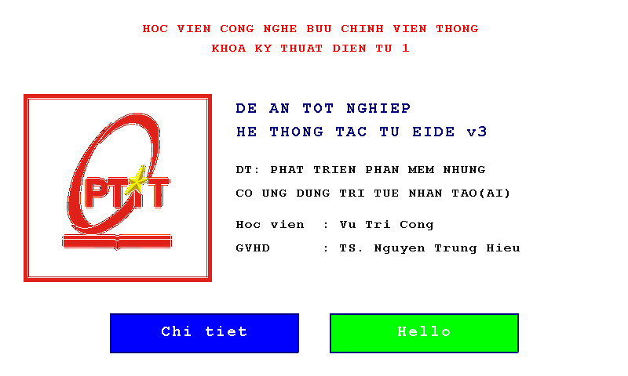

# Tự viết một hệ điều hành thời gian thực, bỏ FreeRTOS

Phiên làm việc thật ngày **30/09/2026**: anh Vũ Trí Công giao cho EIDE dựng một nhân RTOS mới
cho chính con **STM32F469NI** trên bo STM32F469I-DISCO, thay hoàn toàn FreeRTOS, cho tới khi
màn hình LCD lên đúng như bản cũ.



Ảnh trên **không phải ảnh chụp màn hình máy tính**: nó là bộ nhớ khung hình đọc ngược từ SDRAM
của chip qua SWD, sau khi firmware đã chạy trên bo thật.

## Đích và kết quả

| | Bản FreeRTOS cũ | Bản tự viết |
|---|---|---|
| Nhân | FreeRTOS v10 | **1 029 dòng tự viết** (`rtos_core` · `rtos_port` · `rtos_queue` · `main`) |
| Lập lịch | tiền định đa mức ưu tiên | tiền định đa mức ưu tiên, chuyển ngữ cảnh bằng `PendSV` naked assembly |
| Tác vụ | 6 | 6 — LED1 1000 ms · LED2 400 ms · Button (chống rung 30 ms) · LED3 chờ hàng đợi · Monitor · LCD |
| IPC | `xQueue*` | `rtos_queue_*` tĩnh, có timeout |
| Flash | ~263 KB | **259 488 B** |
| Ký hiệu FreeRTOS còn lại trong ảnh | — | **0** |

## Các chặng, và mỗi chặng đi qua cổng nào

1. **Phân tích** — tác tử đọc `tham-khao/main-freertos.c` rồi chỉ ra bản cũ chỉ dùng **9 API**
   FreeRTOS, và ước lượng khối lượng phải tự viết.
2. **Kiến trúc** — ba phương án (`PA-A` tiền định PendSV · `PA-B` hợp tác · `PA-C` kích hoạt
   theo thời gian tĩnh), so bằng tiêu chí đo được, **tự dán nhãn tầng ĐỒNG** vì chưa đo trên
   phần cứng. Ghi thành ba hiện vật `option`.
3. **Chốt hướng** — `store.option_choose` → cổng **G-DESIGN** → người duyệt.
4. **Kế hoạch** — 6 bước, mỗi bước một tệp cụ thể → cổng **G-SCOPE**.
5. **Thực thi** — viết từng tệp, `plan.step_done` sau mỗi bước, `build.compile` để kiểm.
6. **Nạp** — `target.flash` → cổng **G-FLASH** → `target.verify` đọc ngược Flash so từng byte.

## Ba lỗi bắt được, và cách bắt được chúng

### 1. Biên dịch "xong" mà ảnh chỉ 1 416 byte

Hai lần `build.compile` đầu **đỏ**; lần thứ ba bỏ bớt đầu vào thì **xanh**, và ảnh ra 1 416
byte — **không một ký hiệu LCD, UI hay Touch nào**, trong khi dự án có 15 tệp mã.

Tác tử đã thu hẹp đầu vào cho tới khi qua được, rồi báo "biên dịch xong": đúng về lời gọi, sai
về việc. *1 416 byte trông như một con số, không trông như một vấn đề.*

Đây là **lỗi của sản phẩm EIDE**, không phải của tác tử: `build.compile` không hề nói nó đã
dịch những tệp nào. Nay nó so cây nguồn với dòng lệnh thật và **kê ra tệp nào không vào ảnh**
ngay đầu kết quả (xem DEV-311).

### 2. Màn hình đen — PLL của DSI không khoá

Anh Công nhìn bo và báo: **LED nhấp nháy, LCD đen hẳn**. Tác tử dò bằng công cụ phần cứng chứ
không đoán:

* `target.screen` → khung hình **có đủ 6 màu**, giao diện đã vẽ xong vào SDRAM ⇒ phần vẽ không
  sai;
* thanh ghi: `LTDC_GCR = 0xC0002221` (LTDC bật, con trỏ quét đang chạy), nhưng
  **`DSI_WISR` bit `PLLLS = 0`** (PLL chưa khoá), **`DSI_PCTLR = 0`** (D-PHY tắt),
  `DSI_ISR1 = 0x80` (lỗi giao tiếp);
* `target.debug` → không HardFault, bộ lập lịch luân chuyển bình thường.

**Nguyên nhân gốc:** `HAL_Delay()` nay nối vào `rtos_delay_ms()`, nên nó **nhường CPU giữa
chuỗi khởi tạo DSI có ràng buộc thời gian cứng**; `vTaskButton` ưu tiên cao hơn chen vào mỗi
30 ms và làm DSI Host timeout. Bản FreeRTOS không gặp vì `HAL_Delay` ở đó là vòng chờ bận.

### 3. Cảm ứng không ăn — I2C quá nhanh sau khi nâng xung nhịp

Màn lên rồi nhưng bấm nút không đổi trang. Tác tử đọc `GPIOB` xác nhận `Touch_Init()` đã chạy,
rồi tìm ra `i2c_delay()` trong `touch.c` dùng vòng NOP cố định 150 bước — khi xung nhịp lên
180 MHz ở bản sửa DSI, tần số I2C vượt 600 kHz và sườn lên RC của open-drain không kịp.

## Hồ sơ trong thư mục này

| Thư mục | Nội dung |
|---|---|
| `firmware-chay-duoc/` | toàn bộ mã chạy được: nhân `rtos/`, `main.c`, driver, linker script, và `mach.bin` đã nạp lên bo |
| `ho-so-tac-tu/` | sổ cái · changeset · transcript đầy đủ · 18 hiện vật · `du-an.json` |
| `nhat-ky-llm/` | **toàn bộ lời gọi mô hình, cả prompt gửi đi lẫn phản hồi** — 57 MB nén còn 16 MB |
| `ket-qua/` | khung hình đọc từ SDRAM của chip |

Nhật ký LLM ghi được là nhờ `EIDE_GHI_LLM=1` (xem DEV-311). Trước phiên này EIDE chỉ ghi **siêu
dữ liệu** lời gọi — model, token, thời gian — nên khi một lượt đi sai thì câu *"lúc ấy nó nhìn
thấy gì"* không trả lời được.

## Chạy lại

```bash
.venv/bin/python tools/phien_rtos.py --giai-doan 1   # phân tích
.venv/bin/python tools/phien_rtos.py --giai-doan 2   # ba phương án kiến trúc
.venv/bin/python tools/phien_rtos.py --giai-doan 3   # chốt hướng (G-DESIGN)
.venv/bin/python tools/phien_rtos.py --giai-doan 4   # lập kế hoạch (G-SCOPE)
.venv/bin/python tools/phien_rtos.py --giai-doan 5   # thực thi
.venv/bin/python tools/phien_rtos.py --giai-doan 6   # dựng lại cho đủ driver
.venv/bin/python tools/phien_rtos.py --giai-doan 7   # nạp bo, đọc khung hình
.venv/bin/python tools/phien_rtos.py --giai-doan 8   # đủ 6 tác vụ như bản cũ
```

Bo phải cắm vào máy ở chặng 7 trở đi.
