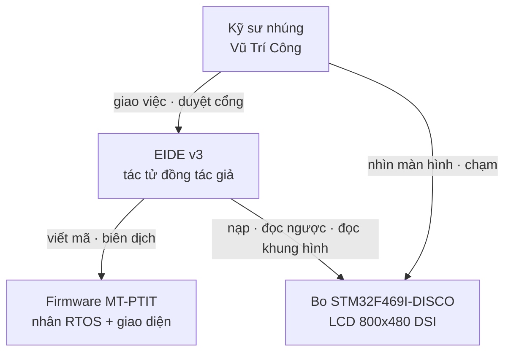
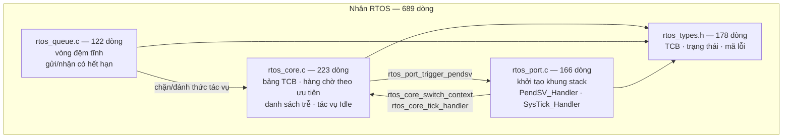
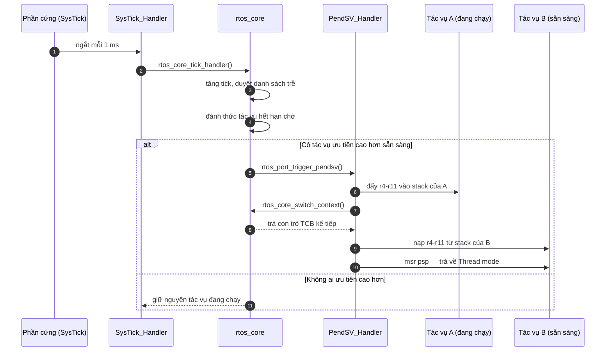

# Tự viết hệ điều hành thời gian thực cho STM32F469NI

*Đề tài: **Phát triển phần mềm nhúng có ứng dụng trí tuệ nhân tạo (AI)*** · Vũ Trí Công ·
GVHD: TS. Nguyễn Trung Hiếu · Học viện Công nghệ Bưu chính Viễn thông

Báo cáo một phiên làm việc thật ngày **30/09/2026**, trong đó tác tử EIDE v3 phân tích, thiết
kế và hiện thực một nhân RTOS mới thay hoàn toàn FreeRTOS trên bo STM32F469I-DISCO.

---

## 1. Yêu cầu

### 1.1. Yêu cầu chức năng

| Mã | Yêu cầu | Nghiệm thu bằng |
|---|---|---|
| YC-01 | Bỏ hoàn toàn FreeRTOS khỏi firmware | Không ký hiệu `xTask*`/`vTask*`/`xQueue*` nào trong tệp ảnh |
| YC-02 | Nhân tự viết chạy đa nhiệm tiền định trên Cortex-M4F | LED nhấp nháy ở hai chu kỳ khác nhau trên bo thật |
| YC-03 | Giữ nguyên sáu tác vụ của bản cũ | Đếm `rtos_task_create` trong `main.c` |
| YC-04 | Truyền tin giữa tác vụ có chờ và có hết hạn | Nút vật lý PA0 đổi trang qua hàng đợi |
| YC-05 | Màn hình LCD 800×480 hiện đúng giao diện cũ | Đọc ngược bộ nhớ khung hình từ SDRAM của chip |
| YC-06 | Cảm ứng điện dung đổi trang khi chạm | Người dùng chạm thật lên bo |

### 1.2. Ràng buộc

- Chip **STM32F469NIH6**, lõi Cortex-M4F, Flash 2 MB, SRAM 324 KB, SDRAM ngoài 16 MB.
- Máy phát triển **không có newlib** cho ARM ⇒ liên kết ở chế độ `-nostdlib`; mọi hàm chuẩn
  phải tự viết hoặc tránh dùng.
- Được phép **tham khảo driver** đã có (LCD/DSI/SDRAM/cảm ứng) của bản FreeRTOS.
- Nạp qua **ST-LINK kiểu ổ đĩa**; cổng ảo `/dev/cu.usbmodem1103` **không nối USART nào**, nên
  không dùng `printf` để gỡ lỗi.

### 1.3. Phạm vi bề mặt phải thay

Bản FreeRTOS chỉ dùng **9 lời gọi**. Đó là toàn bộ hợp đồng phải dựng lại:

| FreeRTOS | Thay bằng |
|---|---|
| `xTaskCreate` | `rtos_task_create` |
| `vTaskStartScheduler` | `rtos_start` |
| `vTaskDelay` · `pdMS_TO_TICKS` | `rtos_delay_ms` |
| `xTaskGetTickCount` | `rtos_get_tick_count` |
| `xQueueCreate` · `xQueueSend` · `xQueueReceive` | `rtos_queue_init` · `rtos_queue_send` · `rtos_queue_receive` |
| `portMAX_DELAY` | `RTOS_WAIT_FOREVER` |

---

## 2. Thiết kế theo mô hình C4

### 2.1. Mức 1 — Bối cảnh hệ thống

### 2.2. Mức 2 — Thành phần trong tệp ảnh

### 2.3. Mức 3 — Bên trong nhân RTOS

Tham số nhân: **32 mức ưu tiên** (0 cao nhất, 31 cho Idle) · tối đa **16 tác vụ** · stack mặc
định **256 từ** (1 KB), Idle **128 từ**.

### 2.4. Mức 4 — Trình tự chuyển ngữ cảnh

Phần cứng tự lưu `r0–r3, r12, LR, PC, xPSR`; `PendSV_Handler` viết bằng **assembly naked** chỉ
phải lo `r4–r11` và con trỏ `psp`. PendSV đặt ở mức ưu tiên ngắt thấp nhất để nó không bao giờ
chen vào giữa một ngắt khác.

---

## 3. Quá trình tác tử thực hiện

### 3.1. Sáu chặng, mỗi chặng một cổng duyệt

| Chặng | Tác tử làm gì | Cổng | Hiện vật để lại |
|---|---|---|---|
| 1. Phân tích | đọc mã tham khảo, chỉ ra 9 API phải thay | — | bản phân tích trong hội thoại |
| 2. Kiến trúc | ba phương án, so bằng tiêu chí đo được | — | 3 hiện vật `option` |
| 3. Chốt hướng | chọn PA-A (tiền định, PendSV) | **G-DESIGN** | ADR |
| 4. Kế hoạch | 6 bước, mỗi bước một tệp | **G-SCOPE** | `plan:current` |
| 5. Thực thi | viết nhân, biên dịch, sửa | **G-FILE** | 4 tệp nhân + `main.c` |
| 6. Nạp và kiểm | nạp, đọc ngược, đọc khung hình | **G-FLASH** | `mach.bin`, ảnh khung hình |

Ba phương án ở chặng 2 được tác tử **tự dán nhãn tầng ĐỒNG**, vì các con số RAM/độ trễ là ước
lượng từ tập lệnh chứ chưa đo trên phần cứng. Đó là kỷ luật N1 của hệ thống: con số nào chưa
đo thì không được đứng cùng hàng với con số đã đo.

### 3.2. Ba lỗi bắt được, và cách bắt được

Không lỗi nào tìm ra bằng đọc mã. Cả ba đều bắt đầu từ **một quan sát trên bo thật**.

| Triệu chứng | Tác tử đo được | Nguyên nhân gốc |
|---|---|---|
| Ảnh chỉ 1 416 byte | 0 ký hiệu LCD/UI/Touch trong ELF | tác tử thu hẹp đầu vào biên dịch cho tới khi qua được |
| LED chạy, **LCD đen** | khung hình có đủ 6 màu ⇒ phần vẽ đúng; `DSI_WISR` bit `PLLLS = 0`, `DSI_PCTLR = 0`, `DSI_ISR1 = 0x80` | `HAL_Delay()` nối vào `rtos_delay_ms()` nên **nhường CPU giữa chuỗi khởi tạo DSI có ràng buộc thời gian cứng** |
| **Cảm ứng không ăn** | `GPIOB` xác nhận `Touch_Init()` đã chạy | `i2c_delay()` dùng vòng NOP cố định; xung nhịp lên 180 MHz làm I2C vượt 600 kHz |

Lỗi DSI đáng ghi nhớ nhất: **nó chỉ tồn tại vì có RTOS**. Bản FreeRTOS không gặp vì `HAL_Delay`
ở đó là vòng chờ bận. Một nhân đúng về lập lịch vẫn có thể phá một khối ngoại vi chỉ vì nó
nhường CPU đúng chỗ không được nhường.

### 3.3. Khối lượng công việc đo được

| Chỉ số | Giá trị |
|---|---|
| Lượt trao đổi người ↔ tác tử | 46 |
| Lời gọi công cụ | 367 (31 loại khác nhau) |
| Công cụ dùng nhiều nhất | `fs.read` ×102 · `fs.glob` ×43 · `fs.grep` ×40 · `ledger.query` ×32 |
| Changeset (thay đổi hoàn tác được) | 20 |
| Hiện vật trong kho | 18 |
| Sự kiện sổ cái | 3 915 |
| Mã nhân viết ra | **1 029 dòng** |
| Flash chiếm | **259 488 B** (bản FreeRTOS: ~263 KB) |

---

## 4. Thời gian và chi phí

### 4.1. Thời gian

| Hạng mục | Giá trị |
|---|---|
| Bắt đầu → kết thúc (thời gian thực) | 08:59:33 → 10:20:44 UTC = **81,2 phút** |
| Thời gian chờ mô hình | **24,8 phút** (30,5 % thời gian thực) |
| Thời gian còn lại | 56,4 phút — biên dịch, nạp, đọc ngược bo, và người đọc kết quả |
| Số lời gọi mô hình | **355** |
| Trung bình mỗi lời gọi | 4,2 giây |
| Trung bình mỗi lượt trao đổi | 1,8 phút |

### 4.2. Token đã dùng

| Loại | Token | Ghi chú |
|---|---|---|
| Vào — tổng | 23 126 605 | |
| Vào — **đã đệm** | 19 793 272 | **85,6 %**, tính giá rẻ hơn nhiều |
| Vào — tính giá đầy đủ | **3 333 333** | phần thật sự mới mỗi lượt |
| Ra | 73 517 | |
| Suy nghĩ | 118 429 | |

Tỉ lệ đệm 85,6 % là con số đáng chú ý nhất ở đây: hiến pháp, lược đồ 122 công cụ và phần đầu
hội thoại lặp lại ở mọi lượt, nên chúng được đệm. **Chi phí thật gần như chỉ phụ thuộc phần
mới của mỗi lượt.**

### 4.3. Chi phí

Kho không lưu bảng giá, nên chi phí trình bày dưới dạng **công thức kèm tham số** — anh thay
đơn giá thật trong hoá đơn vào để có con số cuối.

> **Chi phí = 3,333 × G_vào + 19,793 × G_đệm + 0,192 × G_ra**
> *(đơn vị: triệu token; `G_ra` áp cho cả token ra và token suy nghĩ)*

| Kịch bản đơn giá (USD / triệu token) | Vào | Đệm | Ra | **Chi phí phiên** |
|---|---|---|---|---|
| A — mức thấp | 0,075 | 0,019 | 0,30 | **≈ 0,69 USD** |
| B — mức giữa | 0,15 | 0,0375 | 0,60 | **≈ 1,36 USD** |
| C — mức cao | 0,30 | 0,075 | 2,50 | **≈ 2,96 USD** |

Quy đổi theo kịch bản B: **≈ 34 000 đồng** cho toàn bộ phiên — gồm phân tích, ba phương án
kiến trúc, 1 029 dòng nhân RTOS, sáu lần biên dịch, bốn lần nạp bo, và ba lần dò lỗi phần cứng
tới tận thanh ghi DSI.

### 4.4. Đối chiếu công sức

| | Ước lượng người làm tay | Phiên này |
|---|---|---|
| Đọc hiểu bản FreeRTOS + driver | 0,5 – 1 ngày | trong 81 phút chung |
| Thiết kế và so ba phương án | 0,5 ngày | |
| Viết 1 029 dòng nhân + gỡ lỗi DSI/I2C | 2 – 4 ngày | |
| **Tổng** | **3 – 5 ngày công** | **81 phút + ≈ 1,4 USD** |

Cột trái là **ước lượng, tầng ĐỒNG** — không đo được trong phiên này, nêu ra để so tương quan
chứ không phải một con số nghiệm thu.

---

## 5. Kết luận

Ba điều phiên này chứng minh được, mỗi điều có bằng chứng kèm theo:

1. **Tác tử gánh được khối lượng phức tạp.** 1 029 dòng nhân RTOS có chuyển ngữ cảnh
   assembly, chạy thật trên chip, giao diện lên đúng như bản cũ.
2. **Quy trình có cổng chặn được việc làm ẩu.** Kế hoạch viết mã mới bị chặn cho tới khi có
   bước chọn kiến trúc; lệnh ghi đè một tệp chưa đọc bị từ chối.
3. **Chỗ hỏng thật nằm ngoài tầm đọc mã.** Cả ba lỗi đều cần đọc thanh ghi trên chip đang chạy
   — và đó đúng là việc mà một tác tử có công cụ phần cứng làm được, còn một trợ lý chỉ sinh
   mã thì không.

Điều phiên này **chưa** chứng minh: nhân RTOS mới chưa qua thử nghiệm dài hạn, chưa đo độ trễ
chuyển tác vụ bằng máy đo, và chưa có bộ kiểm tự động chạy trên phần cứng.
