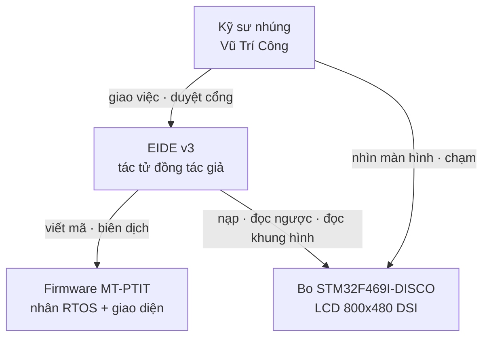
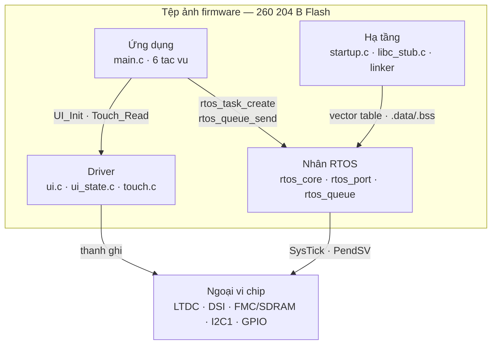
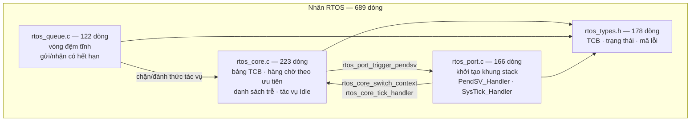
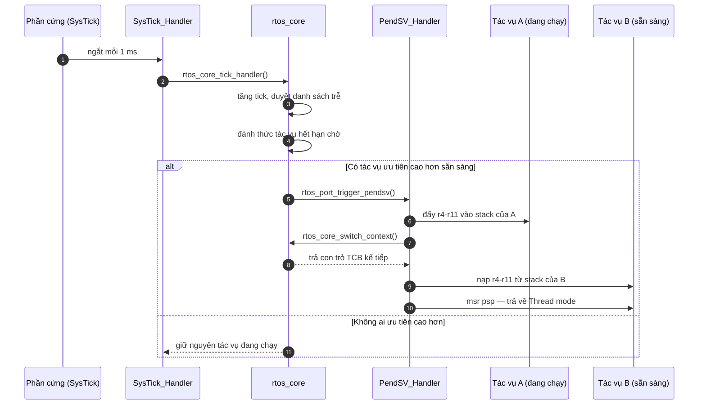

# Tự viết hệ điều hành thời gian thực cho STM32F469NI

*Đề tài: **Phát triển phần mềm nhúng có ứng dụng trí tuệ nhân tạo (AI)*** · Vũ Trí Công ·
GVHD: TS. Nguyễn Trung Hiếu · Học viện Công nghệ Bưu chính Viễn thông

Báo cáo một phiên làm việc thật ngày **30/09/2026**, trong đó tác tử EIDE v3 phân tích, thiết
kế và hiện thực một nhân RTOS mới thay hoàn toàn FreeRTOS trên bo STM32F469I-DISCO.

---

## 1. Yêu cầu

### 1.1. Yêu cầu chức năng

| Mã | Yêu cầu | Nghiệm thu bằng |
|---|---|---|
| YC-01 | Bỏ hoàn toàn FreeRTOS khỏi firmware | Không ký hiệu `xTask*`/`vTask*`/`xQueue*` nào trong tệp ảnh |
| YC-02 | Nhân tự viết chạy đa nhiệm tiền định trên Cortex-M4F | LED nhấp nháy ở hai chu kỳ khác nhau trên bo thật |
| YC-03 | Giữ nguyên sáu tác vụ của bản cũ | Đếm `rtos_task_create` trong `main.c` |
| YC-04 | Truyền tin giữa tác vụ có chờ và có hết hạn | Nút vật lý PA0 đổi trang qua hàng đợi |
| YC-05 | Màn hình LCD 800×480 hiện đúng giao diện cũ | Đọc ngược bộ nhớ khung hình từ SDRAM của chip |
| YC-06 | Cảm ứng điện dung đổi trang khi chạm | Người dùng chạm thật lên bo |

### 1.2. Ràng buộc

- Chip **STM32F469NIH6**, lõi Cortex-M4F, Flash 2 MB, SRAM 324 KB, SDRAM ngoài 16 MB.
- Máy phát triển **không có newlib** cho ARM ⇒ liên kết ở chế độ `-nostdlib`; mọi hàm chuẩn
  phải tự viết hoặc tránh dùng.
- Được phép **tham khảo driver** đã có (LCD/DSI/SDRAM/cảm ứng) của bản FreeRTOS.
- Nạp qua **ST-LINK kiểu ổ đĩa**; cổng ảo `/dev/cu.usbmodem1103` **không nối USART nào**, nên
  không dùng `printf` để gỡ lỗi.

### 1.3. Phạm vi bề mặt phải thay

Bản FreeRTOS chỉ dùng **9 lời gọi**. Đó là toàn bộ hợp đồng phải dựng lại:

| FreeRTOS | Thay bằng |
|---|---|
| `xTaskCreate` | `rtos_task_create` |
| `vTaskStartScheduler` | `rtos_start` |
| `vTaskDelay` · `pdMS_TO_TICKS` | `rtos_delay_ms` |
| `xTaskGetTickCount` | `rtos_get_tick_count` |
| `xQueueCreate` · `xQueueSend` · `xQueueReceive` | `rtos_queue_init` · `rtos_queue_send` · `rtos_queue_receive` |
| `portMAX_DELAY` | `RTOS_WAIT_FOREVER` |

---

## 2. Thiết kế theo mô hình C4

### 2.1. Mức 1 — Bối cảnh hệ thống

### 2.2. Mức 2 — Thành phần trong tệp ảnh

### 2.3. Mức 3 — Bên trong nhân RTOS

Tham số nhân: **32 mức ưu tiên** (0 cao nhất, 31 cho Idle) · tối đa **16 tác vụ** · stack mặc
định **256 từ** (1 KB), Idle **128 từ**.

### 2.4. Mức 4 — Trình tự chuyển ngữ cảnh

Phần cứng tự lưu `r0–r3, r12, LR, PC, xPSR`; `PendSV_Handler` viết bằng **assembly naked** chỉ
phải lo `r4–r11` và con trỏ `psp`. PendSV đặt ở mức ưu tiên ngắt thấp nhất để nó không bao giờ
chen vào giữa một ngắt khác.

---

## 3. Quá trình tác tử thực hiện

### 3.1. Sáu chặng, mỗi chặng một cổng duyệt

| Chặng | Tác tử làm gì | Cổng | Hiện vật để lại |
|---|---|---|---|
| 1. Phân tích | đọc mã tham khảo, chỉ ra 9 API phải thay | — | bản phân tích trong hội thoại |
| 2. Kiến trúc | ba phương án, so bằng tiêu chí đo được | — | 3 hiện vật `option` |
| 3. Chốt hướng | chọn PA-A (tiền định, PendSV) | **G-DESIGN** | ADR |
| 4. Kế hoạch | 6 bước, mỗi bước một tệp | **G-SCOPE** | `plan:current` |
| 5. Thực thi | viết nhân, biên dịch, sửa | **G-FILE** | 4 tệp nhân + `main.c` |
| 6. Nạp và kiểm | nạp, đọc ngược, đọc khung hình | **G-FLASH** | `mach.bin`, ảnh khung hình |

Ba phương án ở chặng 2 được tác tử **tự dán nhãn tầng ĐỒNG**, vì các con số RAM/độ trễ là ước
lượng từ tập lệnh chứ chưa đo trên phần cứng. Đó là kỷ luật N1 của hệ thống: con số nào chưa
đo thì không được đứng cùng hàng với con số đã đo.

### 3.2. Ba lỗi bắt được, và cách bắt được

Không lỗi nào tìm ra bằng đọc mã. Cả ba đều bắt đầu từ **một quan sát trên bo thật**.

| Triệu chứng | Tác tử đo được | Nguyên nhân gốc |
|---|---|---|
| Ảnh chỉ 1 416 byte | 0 ký hiệu LCD/UI/Touch trong ELF | tác tử thu hẹp đầu vào biên dịch cho tới khi qua được |
| LED chạy, **LCD đen** | khung hình có đủ 6 màu ⇒ phần vẽ đúng; `DSI_WISR` bit `PLLLS = 0`, `DSI_PCTLR = 0`, `DSI_ISR1 = 0x80` | `HAL_Delay()` nối vào `rtos_delay_ms()` nên **nhường CPU giữa chuỗi khởi tạo DSI có ràng buộc thời gian cứng** |
| **Cảm ứng không ăn** | `GPIOB` xác nhận `Touch_Init()` đã chạy | `i2c_delay()` dùng vòng NOP cố định; xung nhịp lên 180 MHz làm I2C vượt 600 kHz |

Lỗi DSI đáng ghi nhớ nhất: **nó chỉ tồn tại vì có RTOS**. Bản FreeRTOS không gặp vì `HAL_Delay`
ở đó là vòng chờ bận. Một nhân đúng về lập lịch vẫn có thể phá một khối ngoại vi chỉ vì nó
nhường CPU đúng chỗ không được nhường.

### 3.3. Khối lượng công việc đo được

| Chỉ số | Giá trị |
|---|---|
| Lượt trao đổi người ↔ tác tử | 46 — trong đó **21 lần anh gõ**, 9 lần quyết cổng duyệt, 15 lần xem, 1 lần chọn phương án |
| Lời gọi công cụ | 367 (31 loại khác nhau) |
| Công cụ dùng nhiều nhất | `fs.read` ×102 · `fs.glob` ×43 · `fs.grep` ×40 · `ledger.query` ×32 |
| Changeset (thay đổi hoàn tác được) | 20 |
| Hiện vật trong kho | 18 |
| Sự kiện sổ cái | 3 915 — trong đó 311 lời gọi mô hình ở vòng chính |
| Lời gọi mô hình ghi được nguyên văn | **351** = 307 vòng chính + **44 của tác tử con** |
| Mã tác tử viết ra | **1 029 dòng** = nhân 689 + ứng dụng `main.c` 340 |
| Mã dùng lại không sửa | 757 dòng driver (`ui.c` · `touch.c` · `startup.c` · `libc_stub.c`) |
| Flash chiếm | **260 204 B** (bản FreeRTOS: 263 740 B — ít hơn 3 536 B) |
| RAM tĩnh (`.bss`) | **13 596 B** (bản FreeRTOS: 36 424 B — ít hơn 22 828 B) |

---

## 4. Thời gian và chi phí

### 4.1. Thời gian

| Hạng mục | Giá trị |
|---|---|
| Bắt đầu → kết thúc (thời gian thực) | 08:59:33 → 10:20:44 UTC = **81,2 phút** |
| Thời gian chờ mô hình | **24,8 phút** (30,5 % thời gian thực) |
| Thời gian còn lại | 56,4 phút — biên dịch, nạp, đọc ngược bo, và người đọc kết quả |
| Số lời gọi mô hình | **355** |
| Trung bình mỗi lời gọi | 4,2 giây |
| Trung bình mỗi lượt trao đổi | 1,8 phút |

### 4.2. Token đã dùng

| Loại | Token | Ghi chú |
|---|---|---|
| Vào — tổng | 23 126 605 | |
| Vào — **đã đệm** | 19 793 272 | **85,6 %**, tính giá rẻ hơn nhiều |
| Vào — tính giá đầy đủ | **3 333 333** | phần thật sự mới mỗi lượt |
| Ra | 73 517 | |
| Suy nghĩ | 118 429 | |

Tỉ lệ đệm 85,6 % là con số đáng chú ý nhất ở đây: hiến pháp, lược đồ 122 công cụ và phần đầu
hội thoại lặp lại ở mọi lượt, nên chúng được đệm. **Chi phí thật gần như chỉ phụ thuộc phần
mới của mỗi lượt.**

### 4.3. Chi phí

Kho không lưu bảng giá, nên chi phí trình bày dưới dạng **công thức kèm tham số** — anh thay
đơn giá thật trong hoá đơn vào để có con số cuối.

> **Chi phí = 3,333 × G_vào + 19,793 × G_đệm + 0,192 × G_ra**
> *(đơn vị: triệu token; `G_ra` áp cho cả token ra và token suy nghĩ)*

| Kịch bản đơn giá (USD / triệu token) | Vào | Đệm | Ra | **Chi phí phiên** |
|---|---|---|---|---|
| A — mức thấp | 0,075 | 0,019 | 0,30 | **≈ 0,69 USD** |
| B — mức giữa | 0,15 | 0,0375 | 0,60 | **≈ 1,36 USD** |
| C — mức cao | 0,30 | 0,075 | 2,50 | **≈ 2,96 USD** |

Quy đổi theo kịch bản B: **≈ 34 000 đồng** cho toàn bộ phiên — gồm phân tích, ba phương án
kiến trúc, 1 029 dòng mã, sáu lần biên dịch, bốn lần nạp bo, và ba lần dò lỗi phần cứng
tới tận thanh ghi DSI.

---

## 5. Ước lượng nếu làm bằng nhân sự

Phần này trả lời câu: *cùng khối lượng ấy, một công ty chỉ dùng người thì tốn bao nhiêu?*

> **Toàn bộ mục 5 là ƯỚC LƯỢNG — tầng ĐỒNG.** Mục 1–4 là số đo đọc từ sổ cái và nhật ký;
> mục này là phán đoán từ phạm vi đã biết. Hai loại số ấy **không đứng cùng một hàng**, nên
> chúng ở hai mục khác nhau chứ không trộn vào một bảng.

### 5.1. Phương pháp

Dùng **WBS ba điểm (PERT)**: mỗi hạng mục ước ba giá trị — lạc quan (LQ), khả dĩ (KD), bi quan
(BQ) — rồi lấy `E = (LQ + 4×KD + BQ) / 6`. Cách này nói ra được **độ bất định**, thứ mà một con
số đơn lẻ giấu đi.

Giả định nền:

- Đội đã quen STM32 và chuỗi công cụ ARM, **chưa từng viết nhân RTOS**.
- **Driver LCD/DSI/SDRAM/cảm ứng đã có sẵn**, không tính vào khối lượng phát triển — giống hệt
  điều kiện của phiên tác tử.
- 21 ngày công một tháng, 8 giờ một ngày.
- Đã có bo, có máy nạp, không tính chi phí thiết bị.

### 5.2. Bảng phân rã công việc

| Hạng mục | Vai trò | LQ | KD | BQ | **PERT** |
|---|---|---|---|---|---|
| Phân tích hiện trạng: đọc ứng dụng FreeRTOS + driver, chốt bề mặt 9 API | Senior | 1 | 2 | 4 | **2,2** |
| Nghiên cứu chuyển ngữ cảnh Cortex-M4F (PendSV, PSP/MSP, khung stack) | Senior | 1 | 3 | 6 | **3,2** |
| Thiết kế kiến trúc: so ba phương án, chốt, viết ADR | Senior | 1 | 2 | 3 | **2,0** |
| Thiết kế chi tiết: TCB, hàng chờ ưu tiên, danh sách trễ, hàng đợi | Senior | 1 | 2 | 3 | **2,0** |
| Hiện thực tầng port (assembly naked, khởi tạo khung stack) | Senior | 2 | 4 | 8 | **4,3** |
| Hiện thực lõi lập lịch + tác vụ Idle | Mid | 2 | 3 | 6 | **3,3** |
| Hiện thực hàng đợi IPC có hết hạn | Mid | 1 | 2 | 4 | **2,2** |
| Tích hợp 6 tác vụ ứng dụng + driver sẵn có | Mid | 1 | 2 | 4 | **2,2** |
| Dựng hệ thống build: `-nostdlib`, linker script, cờ FPU | Mid | 0,5 | 1 | 3 | **1,2** |
| Gỡ lỗi DSI: PLL không khoá do nhường CPU giữa chuỗi khởi tạo | Senior | 1 | 3 | 8 | **3,5** |
| Gỡ lỗi I2C cảm ứng: định thời vòng NOP sau khi đổi xung nhịp | Senior | 0,5 | 1 | 3 | **1,2** |
| Kiểm thử trên bo: 6 tác vụ, cảm ứng, hồi quy | QA | 1 | 2 | 4 | **2,2** |
| Viết tài liệu: yêu cầu, thiết kế C4, báo cáo | Mid | 1 | 2 | 4 | **2,2** |
| **TỔNG** | | **14** | **29** | **60** | **31,7 ngày công** |

Hai hạng mục **bi quan gấp bốn lần lạc quan** — *tầng port assembly* (2 → 8) và *gỡ lỗi DSI*
(1 → 8). Đó là hai chỗ rủi ro thật, và cả hai đều đã xảy ra đúng như vậy trong phiên tác tử:
lỗi DSI là lỗi khó nhất, phải đọc tới thanh ghi `DSI_WISR` mới ra.

### 5.3. Khoảng tin cậy

Độ lệch chuẩn PERT: **±2,3 ngày**.

| Mức tin | Khoảng |
|---|---|
| ~68 % | **29 – 34 ngày công** |
| ~95 % | **27 – 36 ngày công** |

Nói cách khác: **32 ngày công ± 5**. Một con số tròn "một tháng rưỡi" không sai, nhưng nó
không cho biết đâu là chỗ có thể trượt.

### 5.4. Nguồn lực và thời gian lịch

| Vai trò | Ngày công | Tỉ trọng |
|---|---|---|
| Kỹ sư nhúng **Senior** | 18,4 | 58 % |
| Kỹ sư nhúng **Mid** | 11,1 | 35 % |
| **QA nhúng** | 2,2 | 7 % |
| Quản lý dự án (20 % thời lượng) | 6,3 | — |

Đội tối thiểu: **1 Senior + 1 Mid + QA bán thời gian + PM 20 %**.

**Thời gian lịch ≈ 4 – 5 tuần.** Senior là **đường găng**: 18,4 ngày công của anh ta gần như
không song song hoá được — phân tích, thiết kế, tầng assembly và hai lần gỡ lỗi phần cứng đều
nối tiếp nhau. Thêm người thứ ba **không rút ngắn được** phần này.

### 5.5. Chi phí nhân sự

Đơn giá theo lương tháng thị trường Việt Nam (triệu đồng), nhân **hệ số gánh 1,4** cho bảo hiểm,
chỗ ngồi, thiết bị và chi phí quản lý:

| Vai trò | Thấp | Giữa | Cao |
|---|---|---|---|
| Senior nhúng | 40 | 55 | 70 |
| Mid nhúng | 20 | 27 | 35 |
| QA nhúng | 15 | 20 | 25 |

| Kịch bản | Chi phí phát triển | Kèm PM | Quy đổi |
|---|---|---|---|
| Thấp | 66,1 triệu | ≈ 82 triệu | ≈ 3 300 USD |
| **Giữa** | **90,4 triệu** | **≈ 111 triệu** | **≈ 4 450 USD** |
| Cao | 115,4 triệu | ≈ 142 triệu | ≈ 5 700 USD |

### 5.6. Đối chiếu bằng COCOMO — và vì sao nó lệch

Kiểm chéo bằng COCOMO cơ bản trên **1,029 KSLOC**:

| Chế độ | Người-tháng | Ngày công | Tháng lịch |
|---|---|---|---|
| Organic | 2,47 | 51,9 | 3,5 |
| Embedded | 3,73 | 78,2 | 3,8 |

COCOMO cho **52 – 78 ngày công**, gấp 1,6 – 2,5 lần ước lượng WBS (31,7). Chênh lệch ấy có lý
do, và nói ra thì có ích hơn là chọn con số mình thích:

- COCOMO tính **trọn vòng đời công nghiệp**: đặc tả chính thức, rà soát chéo, kiểm thử hệ thống,
  tài liệu bàn giao, bảo trì ban đầu. Ở đây phần lớn những thứ ấy không có trong phạm vi.
- Nó được hiệu chuẩn trên **dự án lớn**, và được biết là **ước lượng thừa cho dự án rất nhỏ**
  — dưới 2 KSLOC thì hệ số cố định lấn át.
- Phạm vi này **dùng lại driver có sẵn**; COCOMO tính theo dòng mã giao ra mà không trừ phần
  tái sử dụng.

Nên lấy WBS làm số chính, và đọc COCOMO như **cận trên**: nếu đội chưa từng chạm Cortex-M ở
mức thanh ghi, con số thật sẽ trôi về phía 50 ngày hơn là 32.

### 5.7. Đối chiếu với phiên tác tử

| | Làm bằng nhân sự (ước lượng) | Phiên tác tử (đo được) |
|---|---|---|
| Thời gian lịch | **4 – 5 tuần** | **81,2 phút** |
| Công sức | **31,7 ngày công** (±5) | 46 lượt trao đổi của một người |
| Chi phí | **≈ 111 triệu đồng** (mức giữa, kèm PM) | **≈ 34 000 đồng** tiền mô hình |
| Đội hình | 1 Senior + 1 Mid + QA + PM | 1 người + tác tử |

Ba điều cần nói thẳng để bảng trên không bị đọc quá tay:

1. **Chưa phải cùng một sản phẩm.** Nhân RTOS trong phiên này chạy đúng trên bo, nhưng chưa
   qua thử nghiệm dài hạn, chưa đo độ trễ chuyển tác vụ bằng máy, chưa có bộ kiểm tự động chạy
   trên phần cứng. Một đội người ở mức 31,7 ngày công thường giao kèm những thứ đó.
2. **Người vẫn nằm trên đường găng.** 46 lượt trao đổi, và ba lỗi phần cứng đều bắt đầu từ
   việc **một người nhìn vào bo** rồi mô tả triệu chứng. Bỏ người ra thì phiên này không kết
   thúc được.
3. **Chi phí mô hình không phải toàn bộ chi phí.** Chưa tính công của người ngồi cùng
   (81 phút), giấy phép công cụ, và thời gian dựng môi trường.

Cách đọc đúng bảng này: tác tử **không thay thế** 31,7 ngày công, nó **nén** phần lớn trong số
đó xuống còn thời gian một người đọc và quyết.

---

## 6. Kết luận

Ba điều phiên này chứng minh được, mỗi điều có bằng chứng kèm theo:

1. **Tác tử gánh được khối lượng phức tạp.** 689 dòng nhân RTOS có chuyển ngữ cảnh
   assembly, chạy thật trên chip, giao diện lên đúng như bản cũ.
2. **Quy trình có cổng chặn được việc làm ẩu.** Kế hoạch viết mã mới bị chặn cho tới khi có
   bước chọn kiến trúc; lệnh ghi đè một tệp chưa đọc bị từ chối.
3. **Chỗ hỏng thật nằm ngoài tầm đọc mã.** Cả ba lỗi đều cần đọc thanh ghi trên chip đang chạy
   — và đó đúng là việc mà một tác tử có công cụ phần cứng làm được, còn một trợ lý chỉ sinh
   mã thì không.

Điều phiên này **chưa** chứng minh: nhân RTOS mới chưa qua thử nghiệm dài hạn, chưa đo độ trễ
chuyển tác vụ bằng máy đo, và chưa có bộ kiểm tự động chạy trên phần cứng.
