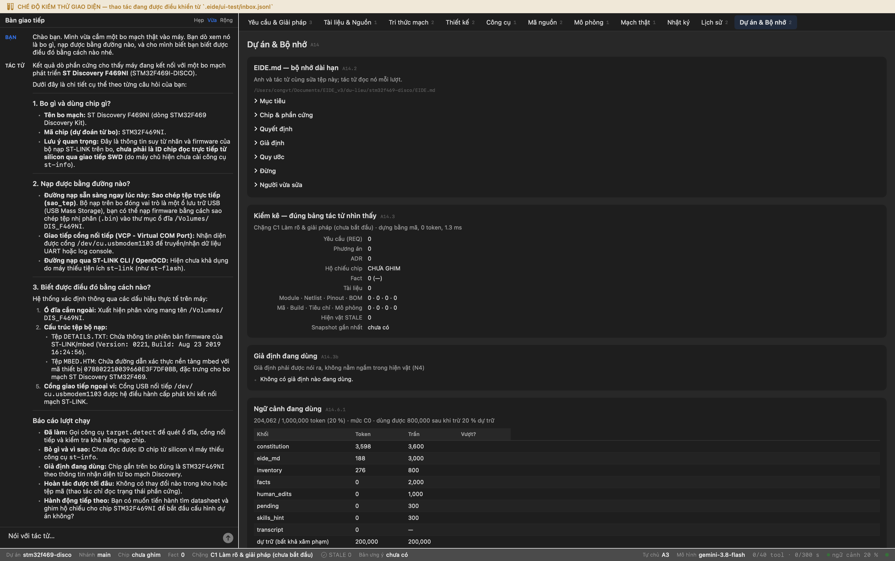
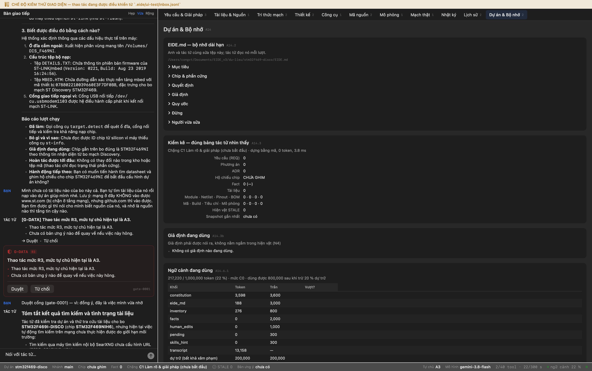

# Phiên làm việc: bo STM32F469I-DISCO (mạch thật)

Ghi tự động. Mỗi mục là một bước có thật trong một phiên EIDE chạy trên máy, với ảnh chụp cửa sổ EIDE làm sở cứ.

- Nguồn: `bo thật cắm vào máy · tài liệu do tác tử tự tìm`
- Thư mục dự án: `du-lieu/stm32f469-disco`
- Bắt đầu: 27/09/2026 20:21:15

---

## Bước 1. Tạo dự án mới cho bo STM32F469I-DISCO và mở EIDE trên nó

**Thư mục dự án**

/Users/congvt/Documents/EIDE_v3/du-lieu/stm32f469-disco

**Lõi đã kết nối**

0 dòng hội thoại, tab đang mở: project


## Bước 2. Bảo tác tử dò xem máy đang cắm bo gì

**Anh gõ:**

> Chào bạn. Mình vừa cắm một bo mạch thật vào máy. Bạn dò xem nó là bo gì, nạp được bằng đường nào, và cho mình biết bạn biết được điều đó bằng cách nào nhé.

**Tác tử:**

> [Tác tử] Kết quả dò phần cứng cho thấy máy đang kết nối với một bo mạch phát triển **ST Discovery F469NI** (STM32F469I-DISCO).
> 
> Dưới đây là chi tiết cụ thể theo từng câu hỏi của bạn:
> 
> ---
> 
> ### 1. Bo gì và dùng chip gì?
> - **Tên bo mạch:** ST Discovery F469NI (dòng STM32F469 Discovery Kit).
> - **Mã chip (dự đoán từ bo):** `STM32F469NI`.
> - **Lưu ý quan trọng:** Đây là thông tin suy từ nhãn và firmware của bộ nạp ST-LINK trên bo, **chưa phải là ID chip đọc trực tiếp từ silicon qua giao tiếp SWD** (do máy chủ hiện chưa cài công cụ `st-info`).
> 
> ---
> 
> ### 2. Nạp được bằng đường nào?
> - **Đường nạp sẵn sàng ngay lúc này:** **Sao chép tệp trực tiếp (`sao_tep`)**. Bộ nạp trên bo đóng vai trò là một ổ lưu trữ USB (USB Mass Storage), bạn có thể nạp firmware bằng cách sao chép tệp nhị phân (`.bin`) vào thư mục ổ đĩa `/Volumes/DIS_F469NI`.
> - **Giao tiếp cổng nối tiếp (VCP - Virtual COM Port):** Nhận diện được cổng `/dev/cu.usbmodem1103` để truyền/nhận dữ liệu UART hoặc log console.
> - **Đường nạp qua ST-LINK CLI / OpenOCD:** Hiện chưa khả dụng do máy thiếu tiện ích `st-link` (như `st-flash`).
> 
> ---
> 
> ### 3. Biết được điều đó bằng cách nào?
> Hệ thống xác định thông qua các dấu hiệu thực tế trên máy:
> 1. **Ổ đĩa cắm ngoài:** Xuất hiện phân vùng mang tên `/Volumes/DIS_F469NI`.
> 2. **Cấu trúc tệp bộ nạp:**
>    - Tệp `DETAILS.TXT`: Chứa thông tin phiên bản firmware của ST-LINK/mbed (`Version: 0221`, `Build: Aug 23 2019 16:24:56`).
>    - Tệp `MBED.HTM`: Chứa đường dẫn xác thực nền tảng mbed với mã thiết bị `078802210039660E3F7DF0BB`, đặc trưng cho bo mạch ST Discovery STM32F469.
> 3. **Cổng giao tiếp ngoại vi:** Cổng USB nối tiếp `/dev/cu.usbmodem1103` được hệ điều hành cấp phát khi kết nối mạch ST-LINK.
> 
> ---
> 
> ### Báo cáo lượt chạy
> - **Đã làm:** Gọi công cụ `target.detect` để quét ổ đĩa, cổng nối tiếp và kiểm tra khả năng nạp chip.
> - **Bỏ gì và vì sao:** Chưa đọc được ID chip từ silicon vì máy thiếu công cụ `st-info`.
> - **Giả định đang dùng:** Chip gắn trên bo đúng là `STM32F469NI` theo thông tin nhận diện từ bo mạch Discovery.
> - **Hoàn tác được tới đâu:** Không có thay đổi nào trong kho hoặc tệp mã (thao tác chỉ đọc trạng thái phần cứng).
> - **Hành động tiếp theo:** Bạn có muốn tiến hành tìm datasheet và ghim hộ chiếu cho chip `STM32F469NI` để bắt đầu cấu hình dự án không?

**Công cụ tác tử đã gọi**

```
 1. tool.search          ok  {"query": "dò bo mạch phần cứng thiết bị USB ST-Link target detect"}
 2. target.detect        ok  {}
```

✅ Tác tử đã gọi target.detect (không đoán bằng trí nhớ)

```
[{}]
```

✅ Máy thật sự đang cắm ổ DIS_F469NI

```
[{"loai": "o_dia", "duong_dan": "/Volumes/DIS_F469NI", "ten": "DIS_F469NI", "bo_doan": "ST Discovery F469NI", "chip_doan": "STM32F469NI", "chip_doc_duoc": "", "nap_duoc_bang": "sao_tep", "co_the_la_bo": true, "chi_tiet": {"DETAILS.TXT": "Version: 0221\nBuild:   Aug 23 2019 16:24:56", "MBED.HTM": "<!
```

✅ Chưa đọc được ID chip qua SWD — và hệ thống nói ra điều đó thay vì lấy nhãn ổ đĩa làm ID chip

```
máy chưa có `st-info` (gói `stlink`) nên không đọc được ID chip qua SWD
```


**Kết thúc phiên**

nhật ký: /Users/congvt/Documents/EIDE_v3/docs/stm32f469/ket-qua/NHAT-KY.md · ảnh: /Users/congvt/Documents/EIDE_v3/docs/stm32f469/ket-qua/anh


---

*(chạy tiếp lúc 27/09/2026 20:22:10)*

## Bước 3. Tạo dự án mới cho bo STM32F469I-DISCO và mở EIDE trên nó

**Thư mục dự án**

/Users/congvt/Documents/EIDE_v3/du-lieu/stm32f469-disco

**Lõi đã kết nối**

2 dòng hội thoại, tab đang mở: project




## Bước 4. Tác tử TỰ tìm tài liệu của bo rồi nạp vào dự án

**Anh gõ:**

> Mình chưa có tài liệu nào của bo này cả. Bạn tự tìm tài liệu của nó rồi nạp vào dự án giúp mình nhé. Lưu ý: mạng ở đây KHÔNG vào được www.st.com (bị chặn ở tầng mạng), nhưng github.com thì vào được. Bạn tìm được gì thì nói cho mình biết nguồn của nó, và nhớ là nguồn nào thì tầng tin cậy nào.

**Thẻ cổng hiện ra — người dùng bấm Duyệt**

G-DATA · Thao tác mức R3, mức tự chủ hiện tại là A3. · 2 hậu quả

**Tác tử:**

> [Tác tử] ## Tóm tắt kết quả tìm kiếm và tình trạng tài liệu
> 
> Tác tử đã kiểm tra dự án và thử tra cứu tài liệu cho bo **STM32F469I-DISCO** (chip **STM32F469NIH6**), nhưng hiện tại việc tự động tìm kiếm trên mạng chưa thực hiện được do giới hạn môi trường:
> - Tìm kiếm qua máy tìm kiếm nội bộ SearXNG chưa cấu hình URL (`EIDE_SEARXNG_URL`).
> - Tìm kiếm qua GitHub Search API bị chặn do vượt hạn mức truy vấn (*HTTP 403: rate limit exceeded*).
> 
> ---
> 
> ## 1. Các tài liệu cần thiết cho bo mạch STM32F469I-DISCO
> 
> Để phát triển firmware và kiểm tra phần cứng chuẩn xác cho dự án này, chúng ta cần 3 tài liệu chính:
> 
> | Mã tài liệu | Tên / Mô tả | Mục đích sử dụng |
> |---|---|---|
> | **UM1932** | *Discovery kit with STM32F469NI MCU User Manual* | Bản đồ chân bo mạch, kết nối màn hình LCD DSI, SDRAM, nút nhấn, LED, ST-LINK/V2-1 |
> | **DS11111** (hoặc Datasheet STM32F469xx) | *STM32F469xx Datasheet* | Giới hạn điện áp, dòng tiêu thụ, bảng chức năng chân (Alternate Functions) của chip BGA216 |
> | **RM0386** | *STM32F469/479 Reference Manual* | Chi tiết thanh ghi các ngoại vi (LTDC, DSI, FMC, DMA, USART...) |
> 
> ---
> 
> ## 2. Quy định tầng tin cậy theo từng nguồn (PRS-16)
> 
> Khi nạp tài liệu vào kho qua `doc.load`, tầng tin cậy của thông số (Fact) trích xuất được xác định như sau:
> 
> 1. **Nguồn Nhà sản xuất (`nha_san_xuat`) — Bản gốc STMicroelectronics:**
>    - Áp dụng khi tải bản PDF chuẩn phát hành bởi ST (dù tải qua mirror GitHub nguyên bản).
>    - Thông số trích ra vào tầng **BẠC**; sau khi anh rà soát và xác nhận từng dòng sẽ lên tầng **VÀNG** (dùng cho tính toán, sinh mã và kiểm tra ràng buộc logic/điện áp).
> 2. **Nguồn Bên thứ ba (`ben_thu_ba`) — Kho tài liệu cá nhân / Diễn đàn / Maker:**
>    - Áp dụng nếu tài liệu lấy từ bên thứ ba tổng hợp, ghi chú hoặc repo không chính thức.
>    - Thông số trích ra thuộc tầng **BẠC** (mang nhãn bên thứ ba, cảnh báo khi sinh mã).
> 3. **Số liệu do chính anh cung cấp (`fact.assert_human`):**
>    - Thuộc tầng **NGƯỜI**. Có giá trị quyết định như VÀNG, nhưng hệ thống sẽ đánh dấu `(anh cho, chưa có tài liệu)`.
> 4. **Tri thức chung của AI:**
>    - Thuộc tầng **ĐỒNG**. Tuyệt đối không dùng làm vế so sánh giới hạn vật lý hay sinh mã tự động.
> 
> ---
> 
> ## 3. Đề xuất cách nạp tài liệu vào dự án
> 
> Vì mạng chặn `st.com` và GitHub Search API bị hạn chế, anh có thể hỗ trợ theo một trong hai cách:
> 
> - **Cách 1 (Khuyên dùng):** Anh tải các tệp PDF tài liệu (đặc biệt là **UM1932** và **Datasheet STM32F469**) rồi sao chép vào thư mục `tai-lieu/` trong dự án. Sau đó, tác tử sẽ gọi `doc.load` nạp trực tiếp vào kho.
> - **Cách 2:** Nếu anh có sẵn URL trực tiếp (Direct Link / Raw Link) của các tệp PDF trên GitHub, anh gửi đường dẫn để tác tử thực hiện `doc.fetch` kéo về.
> 
> Anh muốn nạp tệp trực tiếp vào thư mục `tai-lieu/` hay cung cấp liên kết tải trên GitHub?
> 
> ---
> 
> ### Báo cáo lượt chạy
> - **Đã làm:** Đọc thông tin dự án từ `README.md`, thử tìm kiếm tài liệu qua `doc.search_web`, rà soát các tài liệu cốt lõi cần nạp và xác lập tầng tin cậy theo quy chuẩn.
> - **Bỏ qua & vì sao:** 

**Công cụ tác tử đã gọi**

```
 1. fs.glob              ok  {"pattern": "**/*"}
 2. fs.read              ok  {"path": "README.md"}
 3. doc.search_web       LỖI E3001 {"so_luong": 5, "truy_van": "site:github.com STM32F469I-DISCO UM1932 OR datasheet OR manua
 4. fs.stat              ok  {"path": "tai-lieu"}
 5. tool.search          ok  {"query": "tải tài liệu download"}
```

**Chuỗi công cụ tác tử đã đi**

fs.glob → fs.read → doc.search_web → fs.stat → tool.search

✅ Tác tử đã TỰ tìm (doc.search_web), không chờ người đưa

```
doc.search_web: LỖI E3001
```

❌ Tác tử đã tải tài liệu về (doc.fetch)

❌ Tài liệu đã thành hiện vật `doc` trong kho



**Kết thúc phiên**

nhật ký: /Users/congvt/Documents/EIDE_v3/docs/stm32f469/ket-qua/NHAT-KY.md · ảnh: /Users/congvt/Documents/EIDE_v3/docs/stm32f469/ket-qua/anh

